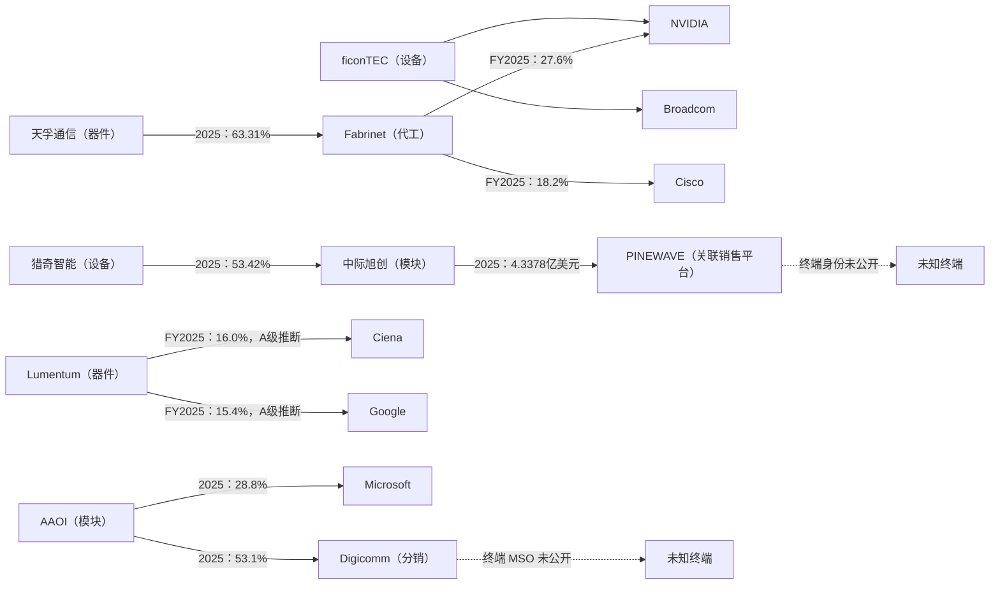

# 光模块产业供货关系：可验证骨架 v1.1（易读版）

> 本版把 v0.1 的完整研究与 v1.0 的扩量结果合并重写。没有新增外部事实，也没有改动
> 证据台账。数据截至 2026-07-23：人工复核台账 81 条边、42 个节点；另有 300 条
> 自动抽取边尚未逐条复核，不用于本报告结论。

## 先说结论

公开披露能回答“谁给谁供货”，但只能回答其中一部分。当前证据支持五个核心判断：

1. **最完整的公开两跳链条是天孚通信 → Fabrinet → NVIDIA/Cisco。** 两段交易均有
   实名披露；但这只能证明双方分别存在供货关系，不能证明天孚的某一批产品最终交付给
   NVIDIA 或 Cisco。
2. **Fabrinet 已从传统光器件代工枢纽转向算力客户代工枢纽。** NVIDIA 在其收入中的
   占比从 FY2023 的 12.5% 升至 FY2024 的 35.1%，FY2025 为 27.6%。
3. **A 股头部模块/器件公司的客户集中度很高，但终端身份大多看不见。** 中际旭创、
   新易盛的主要客户仍以匿名槽位出现；天孚通信实名披露 Fabrinet 是少见例外。
4. **设备层的实名关系主要来自 IPO 文件和问询材料，不是年报。** 猎奇智能的 IPO 文件
   同时点名客户与供应商；扩量检查的多数设备公司年报只给匿名客户。
5. **真正的公开信息硬边界是交易夹层。** 匿名名称有时能靠历史披露和金额指纹解开；
   平台、出口代理和分销商背后的终端客户通常仍不可见。

## 怎么看这张图

- 箭头表示供货方向：`供方 → 客户`；
- 实线表示直接披露或 A 级推断；虚线表示下游身份仍未知；
- 百分比是该客户占供方收入的比例，除非文字另有说明；
- 下图只画最有解释力的关系，不是全部 81 条边。

## 一、已经能确认“谁给谁供货”

下表优先列最能说明产业结构的关系。完整清单见 [edges.csv](edges.csv)。

| 供方 → 客户 | 最新或关键披露 | 证据等级 | 这条边说明什么 |
|---|---:|---|---|
| 天孚通信 → Fabrinet | 2023：53.61%；2024：61.69%；2025：63.31% | 实边，E072/E073/E043 | 天孚对 Fabrinet 的销售占比连续上升，2025 年销售额约 32.69 亿元 |
| Fabrinet → NVIDIA | FY2023：12.5%；FY2024：35.1%；FY2025：27.6% | 实边，E069/E002/E001 | NVIDIA 已成为 Fabrinet 最大客户 |
| Fabrinet → Cisco | FY2023：15.6%；FY2024：13.4%；FY2025：18.2% | 实边，E070/E004/E003 | Cisco 是 Fabrinet 持续的大客户 |
| Fabrinet → Lumentum | FY2023：15.4% | 实边，E068 | 也从 Lumentum 采购披露侧被反向锁定，形成双侧证据（E038） |
| AAOI → Microsoft | 2023：46.6%；2024：43.7%；2025：28.8% | 实边，E017-E019 | Microsoft 依赖度下降，但仍是大客户 |
| AAOI → Digicomm | 2023：11.3%；2024：34.1%；2025：53.1% | 实边，E023-E025 | 分销商占比快速上升，但分销商背后的终端 MSO 不可见 |
| AAOI → Oracle | 2024：12.4% | 实边，E020 | 2023 年匿名、次年追溯实名，是“披露史考古”的样本 |
| Lumentum → Ciena | FY2025：16.0% | A 级推断，E036 | 匿名 Customer A 被历史占比序列锁定为 Ciena |
| Lumentum → Google | FY2024：18.9%；FY2025：15.4% | 2024 实边；2025 A级推断，E035/E037 | 云客户直销在公开文件中少见地可见 |
| 猎奇智能 → 中际旭创 | 2023：62.19%；2024：58.85%；2025：53.42% | 实边，E045 | 猎奇对单一光模块客户依赖很高，但占比逐年下降 |
| 猎奇智能 → 光迅科技 | 2024：11.23% | 实边，E048 | 设备商向模块厂供货的直接证据 |
| 猎奇智能 → 源杰科技 | 2023：10.77% | 实边，E049 | 设备需求会随扩产周期明显波动 |
| 猎奇智能 → 索尔思 | 2025：6.55% | 实边，E047 | 猎奇拓展到另一家光模块客户 |
| ficonTEC → NVIDIA | 截至 2024-12：超过 50 台、4,800 万欧元 | 实边，E012 | CPO 耦合设备已进入 NVIDIA 供应链 |
| ficonTEC → Broadcom | 已交付 14 台 CPO 耦合设备 | 实边，E011 | 设备商进入 Broadcom CPO 供应链 |
| 光迅科技 → 烽火通信 | 2023：5.59%，约 3.69 亿元 | 实边，E074 | 关联方占比与客户行占比相等，帮助定位实名客户 |

## 二、这张公开图为什么“不完整”

### 1. 披露制度决定了我们看见什么

不同文件的可见度差异很大：

| 文件类型 | 通常能看见什么 | 看不见什么 |
|---|---|---|
| 美股 10-K | 部分大客户实名及多年占比；不同公司实名程度不同 | 供应商通常匿名，部分公司连客户也长期匿名 |
| A 股年报 | 前五大客户/供应商的金额与占比 | 对手方名称通常匿名 |
| A 股关联交易与收入确认段落 | 关联平台、出口代理等实名主体 | 主体背后的最终客户 |
| IPO 招股书与问询材料 | 客户和供应商可能双侧实名 | 上市后年报往往重新匿名 |

所以，这张图更准确的名字是“**公开披露可验证骨架**”，而不是完整产业全景。

### 2. 高集中度不等于客户身份清楚

- 中际旭创 2025 年前四大匿名客户分别占 24.06%、18.26%、14.22%、11.34%；另有
  匿名第一大供应商占采购额 35.76%（E055-E059）。
- 新易盛 2025 年前四大匿名客户分别占 22.97%、16.64%、15.63%、10.96%；第一大
  匿名供应商占采购额 23.87%（E060-E064）。
- Coherent 连续三个财年只披露 10% 以上客户的占比，不披露名称（E039-E042）。

这些数字能说明客户集中风险，却不能支持“客户 A 就是某家云厂商”之类的点名判断。

### 3. 实名也可能只到达中间层

三条边最能说明这个问题：

- 中际旭创 → PINEWAVE：2025 年关联销售 4.3378 亿美元。PINEWAVE 是旭创关联销售
  平台，不是终端客户（实边，E044）。
- 新易盛 → 浙江省粮油食品进出口股份有限公司：年报在收入确认政策中连续点名该
  出口代理，但没有披露代理背后的境外客户（程序段落泄漏，E016）。
- AAOI → Digicomm：2025 年占 AAOI 收入 53.1%，但 Digicomm 是 CATV 分销商，终端
  MSO 仍不可见（实边，E025）。

因此，“解开匿名名称”与“看见最终需求方”是两件不同的事。

## 三、三条值得记住的时间线

### Fabrinet：客户重心从器件厂转向算力客户

FY2020，Fabrinet 的主要客户是 Lumentum 19%、Acacia 10%、Infinera 10%
（E005-E007）。FY2023，NVIDIA 首次进入 10% 以上客户表，占 12.5%（E069）；
FY2024 升至 35.1%（E002），FY2025 为 27.6%（E001）。这不是简单的客户排名变化，
而是 Fabrinet 收入重心从传统光通信器件客户向算力系统客户迁移。

### 天孚通信：对 Fabrinet 的依赖与销售规模同步上升

天孚对 Fabrinet 的销售占比从 2023 年 53.61% 升至 2025 年 63.31%，对应销售额从
约 10.39 亿元升至 32.69 亿元（E072/E073/E043）。这证明两者关系显著加深；但公开
文件没有把天孚的具体产品与 Fabrinet 的具体终端订单逐笔对应起来。

### NeoPhotonics—华为：一条已经死亡的供应链

华为占 NeoPhotonics 收入的比例在 2017-2020 年长期约为 40%—46%；2019 年华为进入
BIS 实体清单，2020 年管制升级，2020 年第四季度该收入归零，2021 年公司宣布已不再
依赖华为，2022 年被 Lumentum 收购（已死亡实边，E008）。它展示了政策冲击怎样把
一条高集中度客户关系压缩到零。

## 四、目前明确不知道什么

以下不是“研究漏做”，而是证据边界：

1. 中际旭创客户 A-D、新易盛前四大客户分别是谁；
2. PINEWAVE、浙江粮油和 Digicomm 背后的最终客户是谁；
3. Coherent FY2023-FY2025 的大客户是谁；
4. 凯格精机是否向 Fabrinet 交付相关产线：公司互动平台未点名，媒体点名且数量口径
   冲突，当前只保留半边（E014）；
5. 300 条机器抽取边中尚未人工复核的关系是否都能晋级为正式证据。

云巨头直销槽位最多只能做 C 级推断，不能承担核心结论。没有公开证据时，报告宁可
保留匿名，也不把行业传闻写成事实。

## 五、证据怎样分级

| 等级 | 判断标准 | 本报告中的用法 |
|---|---|---|
| 实边 | 披露文件直接点名双方，并给出年份及占比或金额 | 直接陈述 |
| 推断边（A级） | 多份硬证据互相锁定，且已排除会计期、汇率、多实体与夹层等陷阱 | 明确写“推断”后使用 |
| 半边 / 半边槽位 | 只知道一方和金额/占比，另一方匿名，或点名证据存在冲突 | 只描述集中度或待核问题 |
| 程序段落泄漏 | 名称出现在收入确认、关联交易等程序性段落 | 先辨认它是终端还是中间层 |
| 机器层 | 自动抽取且未逐条回到原文复核 | 不用于本报告承重结论 |

三例 A 级解匿的完整证据链、陷阱排除与可推翻条件，见
[deanonymization-cases.md](deanonymization-cases.md)。

## 六、从哪里继续核对

- [edges.csv](edges.csv)：81 条人工边；字段包括供方、需方、金额/占比、财年、等级、
  证据文件、锚点和验证状态；
- [nodes.csv](nodes.csv)：42 个节点及其类型、国别和代码；
- [光模块产业图谱-v1.0.html](光模块产业图谱-v1.0.html)：交互查看关系；
- [deanonymization-cases.md](deanonymization-cases.md)：匿名客户判定过程；
- `../demo/out/edges.csv`：300 条机器抽取边，仅用于筛查和监测。

本报告中的 E 编号与 `edges.csv` 一一对应。需要引用某条关系时，先打开对应 E 行，
再沿“证据文件 + 锚点”回到原始披露核对。
