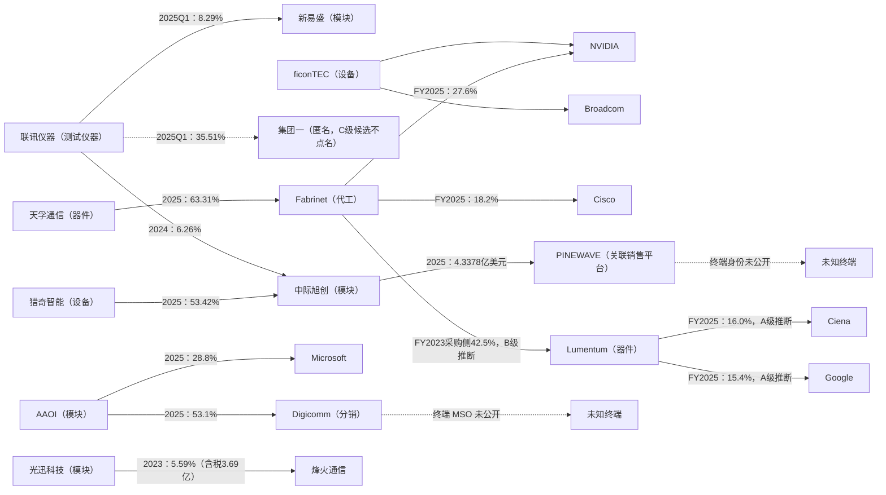

# 光模块产业供货关系：可验证骨架 v1.4

> 本版是 v1.1 易读版的接替版：台账快照 **99 条人工复核边 / 48 个节点**（2026-07-24，
> 见 VERSION-STATE.md），依据 2026-07-23 独立红队（24 项发现）重写；本版仍接受
> 后续复审（2026-07-24 整轮评审的修订已并入本文）。
> 另有 300 条机器抽取边未逐条复核，不用于本报告结论。每句结论标注它是
> **[数据]**（原文可核）还是 **[推断]**（并给等级）。

## 先说结论

公开披露能回答"谁给谁供货"，但只能回答其中一部分。当前证据支持六个核心判断：

1. **[数据]** 天孚通信对 Fabrinet 的销售占比三年连升：2023 年 53.61%（10.39 亿元）
   → 2024 年 61.69%（20.06 亿元）→ 2025 年 63.31%（32.69 亿元）（E072/E073/E043）。
   **[推断]** 这只证明天孚销售侧依赖加深；Fabrinet 采购侧对天孚的依赖度未披露，
   两跳链条（天孚→Fabrinet→NVIDIA）中的产品级穿透公开信息不能证明。
2. **[数据]** 两个口径不同的序列并列陈述：NVIDIA 占 Fabrinet 收入 FY2023
   12.5% → FY2024 35.1% → FY2025 27.6%（E069/E002/E001）；另一序列中，Lumentum
   对其匿名"代工厂 A"的净存货采购占比 42.5% → 30.3% → 25.1%（E038，该代工厂
   B 级推断为 Fabrinet）。**[推断]** 两个序列分母不同、口径不可比，方向相反是
   并列观察，既不构成"收入重心转移"也不构成"产能转移"的证明。
3. **[数据]** 在本项目覆盖的中际旭创、新易盛 2025 年样本中，客户集中度高但身份
   不可见：旭创前四大匿名客户合计 67.88%，新易盛前四大合计 66.20%，均无名称
   （E055-E064）——两家样本不外推为"A 股头部模块厂"总体。实名可见的例外
   来自三类文件：关联交易表（旭创→PINEWAVE）、收入确认政策段（新易盛→浙江粮油
   出口代理）、IPO 文件（猎奇、联讯双侧实名）。
4. **[观察]** 本项目取得的两份设备/仪器 IPO 文件提供了比 A 股模块厂年报密集
   得多的实名关系：猎奇智能（对旭创 2025 年 53.42%）与联讯仪器（18 条边、
   2022-2025Q1 四期客户序列）都双侧实名；联讯的客户表同时覆盖模块厂（新易盛、
   旭创、光迅）、芯片厂（士兰微、三安）与海外芯片商（Broadcom），是目前台账里
   横截面最宽的单一信源（未做层级实名率统计，此为文件类型层面的观察）。
5. **[数据]** NeoPhotonics 对华为收入占比 40-46%（2017-2020），2020Q4 归零
   （E008，当前台账唯一 confirmed_ended 边）。**[观察]** 该归零序列与华为进入
   实体清单（2019）及管制升级（2020）时间相邻；NeoPhotonics 2022 年被 Lumentum
   收购是独立的公司事件——三类事实（政策事件/关系观测/并购）来源不同，
   此处不作因果断言。
6. **[数据]** 本轮出现一个可复算的含税/不含税口径案例：光迅 2023 前五大客户表中
   烽火行 369,224,117.92 元 = 关联交易附注不含税商品销售额 326,747,006.96 元 ×
   1.13（差 0.06 元，舍入级；E074，单一公司单一年份单一表行）。**[推断]** 跨表
   金额指纹比对必须先核验两侧税口径；在 13% 税率且一侧含税、一侧不含税的情形下，
   忽略税口径会制造约 13% 的假差异。单例不支持"A 股前五大客户表一律含税"的
   全称结论，逐公司逐表核验是纪律要求。

## 怎么看这张图

- 箭头表示供货方向：`供方 → 客户`；百分比是该客户占**供方收入**的比例（E038 例外，
  是客户采购侧占比），除非文字另有说明；
- 实线 = 直接披露或 A 级推断；虚线 = 下游身份未知；
- 只画最有解释力的关系，不是全部 99 条边。

## 一、已经能确认"谁给谁供货"

台账 99 条边的等级构成：**实边 65**（其中 1 条已死亡）、**半边槽位 29**（单侧
披露、对手匿名）、**推断边 2 条 A 级 + 1 条 B 级**、程序段落泄漏 1、半边 1
（65+29+3+1+1=99）。下表列最有
解释力的关系，完整清单见 [edges.csv](edges.csv)。

| 供方 → 客户 | 关键披露 | 证据 | 这条边说明什么 |
|---|---:|---|---|
| 天孚通信 → Fabrinet | 2023:53.61% → 2025:63.31%（32.69亿元） | 实边 E072/E073/E043 | 器件→代工的高依赖直销，A股实名披露的少见例外 |
| Fabrinet → NVIDIA | FY2023:12.5% → FY2024:35.1% → FY2025:27.6% | 实边 E069/E002/E001 | NVIDIA 成为 Fabrinet 最大客户 |
| Fabrinet → Cisco | FY2023:15.6% → FY2025:18.2% | 实边 E070/E004/E003 | 传统网络设备需求持续 |
| Fabrinet → Lumentum | FY2020:19% → FY2025 双口径序列 | 实边 E005/E068 + B级 E038 | 双侧证据：Fabrinet 收入侧实名 + Lumentum 采购侧匿名反照 |
| AAOI → Microsoft / Digicomm / Oracle | 2025:28.8% / 53.1% / 2024:12.4% | 实边 E017-E025 | 云直销、分销夹层、追溯实名三种形态并存 |
| Lumentum → Ciena / Google | FY2025:16.0% / 15.4% | A级推断 E036/E037（判例#003） | 披露史考古解匿：FY2025 匿名表被历史占比列锁定 |
| 中际旭创 → PINEWAVE | 2025:8.10%（30.97亿元） | 实边 E044（判例#002 A级） | 客户E=自设关联销售平台；解匿完成但终端仍不可见 |
| 猎奇智能 → 中际旭创 | 2023:62.19% → 2025:53.42% | 实边 E010/E045 | 设备商对单一模块客户的高依赖，逐年下降 |
| 猎奇智能 → 光迅/源杰/索尔思 | 2024:11.23% / 2023:10.77% / 2025:6.55% | 实边 E048/E049/E047 | 设备需求随扩产周期波动 |
| ficonTEC → NVIDIA / Broadcom | >50台4800万欧元 / 14台 | 实边 E012/E011 | CPO 耦合设备进入算力芯片供应链 |
| 联讯仪器 → 新易盛/旭创/光迅/海信/士兰微/三安/Broadcom | 2022-2025Q1 四期序列 | 实边 E082-E095 | 测试仪器层横截面：模块厂与芯片厂同表可见 |
| 光迅科技 → 烽火通信 | 2023:5.59%（含税3.69亿元） | 实边 E074 | 项目首条完成双侧对账的边（见§四） |
| NeoPhotonics → 华为 | 2017-2020:40-46% → 归零 | 实边(已死亡) E008 | 政策冲击完整生命周期样本 |

## 二、这张公开图为什么"不完整"

### 1. 披露制度决定了我们看见什么

| 文件类型 | 通常能看见什么 | 看不见什么 |
|---|---|---|
| 美股 10-K | 部分大客户实名及多年占比；实名程度因公司而异 | 供应商通常匿名；部分公司客户也长期匿名（Coherent） |
| A 股年报 | 前五大客户/供应商金额与占比（税口径需逐公司逐表核验；光迅 2023 E074 为一例含税案例） | 对手方名称通常匿名 |
| A 股关联交易/收入确认段落 | 关联平台、出口代理等实名主体（不含税口径） | 主体背后的最终客户 |
| IPO 招股书与问询材料 | 客户和供应商可能双侧实名 | 上市后年报往往重新匿名 |

所以这张图更准确的名字是"**公开披露可验证骨架**"——在本项目覆盖范围内它是实名度
最高的公开重构，但不是产业全景。

### 2. 高集中度 ≠ 客户身份清楚

- **[数据]** 旭创 2025 前四大匿名客户 24.06%/18.26%/14.22%/11.34%，匿名第一大
  供应商占采购 35.76%（E055-E059）；新易盛前四大 22.97%/16.64%/15.63%/10.96%
  （E060-E064）；Coherent 连续三财年只给占比不给名称（E039-E042）。
- **[推断]** 这些槽位最多支持 C 级推断，不承担本报告任何核心结论。云巨头直销槽位
  的诚实上限就是 C 级。

### 3. 实名也可能只到达中间层

- 旭创 → PINEWAVE（关联销售平台，E044）、新易盛 → 浙江粮油（出口代理，E016）、
  AAOI → Digicomm（CATV 分销，E025）：三条边的对手方都已实名，但**终端需求方
  都不可见**。"解开匿名名称"与"看见最终需求方"是两件事。
- **[红队订正后的统一表述]** 身份指纹成立 ≠ 物流穿透成立：全部解匿判例只回答
  "计费/披露对手方是谁"，不证明货物实际流向。

## 三、时间维度：从静态占比到关系序列

本轮把 99 条边重构为**关系级时间轴**（145 个事件行，flows/out/relationship-timeline.csv）：
每条关系标注 first_observed / observed / last_observed / confirmed_started /
confirmed_ended / censored 六态，跨边合并必须保留来源边号，同期冲突口径不择一。

三条最有信息量的序列：

1. **Fabrinet ⇄ Lumentum 双口径并存**：FY2023 同期存在 15.4%（Fabrinet 收入侧，
   E068）与 42.5%（Lumentum 采购侧，E038）两行——分母不同，**不是矛盾而是两种
   观测**，时间轴上显式标记 conflict 并存。
2. **猎奇 → 旭创跨信源连续**：2023:62.19% → 2024:58.85%（IPO 文件与年报双源一致，
   E010+E045）→ 2025:53.42%。
3. **NeoPhotonics → 华为**：台账唯一 confirmed_ended，其余 98 条边在"最后观测"
   之后都只是 censored（看不见 ≠ 结束）。

## 四、本轮方法论进展：三个判定工序的实测结果

### 1. 判例终审：2 个 A 级、1 个 B 级终态

- **判例#002**（旭创客户E = PINEWAVE）：A 级。占比逐位相等 + 金额指纹（4.3378 亿
  美元×汇率≈30.97 亿元）+ 身份公告三重互锁。
- **判例#003**（Lumentum Customer A-D = Ciena/Google/Apple/Nokia）：A 级。
  披露史考古一步命中，四行历史占比唯一无冲突匹配。
- **判例#004**（Lumentum 代工厂A = Fabrinet）：**当前公开证据集下 B 级终态**
  （出现客户级归类证据可重开）。红队指出排他性分母（total net inventory
  purchases）与 Fabrinet 确认收入口径不同后降级；终审把 U/L 双门算尽——原始
  输入（收入/成本/存货各项）逐项回到 10-K 原文，净存货采购上界 $1,272.1M 与
  Fabrinet 对 Lumentum 收入 $407.4M、"全额进入分母则占 32%"均为**可复算派生值**；
  但客户级会计归类（L 门）无公开证据。除非任一方披露客户级构成，B 级即为终点。
- 判例#005（"旭创双流"）被红队推翻降为 C 级一致性假设；判例#006（联讯"集团一"）
  停在 **C 级候选不点名**——产品指纹（1.6T 测试三件套+400G 扩产采购节奏）只支持
  "包含较大规模光模块测试需求"，不支持点名任何集团。

### 2. 双侧对账：第一个逐位镜像确认

对 15 个双侧候选（13 个预判制度性不可见）中可比的两对跑了首轮对账：

- **光迅 ⇄ 烽火（E074）**：技术服务**子项** 17,462,500.00 元在双方年报逐位
  镜像确认；**E074 商品主金额未双侧闭合**（两句必须一起引用，不可拆开）。商品
  口径在集团粒度差 4.9%（1,602 万元）未解，五分类判定 = **口径不可比（整体）+
  子项双侧确认**。副产品是§先说结论第 6 条的含税口径单例。
- 另一对判"弱一致（不升级）"。**单侧不披露从不等于虚报**——对账五分类里没有
  "对方造假"这个选项，只有"实质矛盾"且需双侧原文支撑。

### 3. 海关通道：图谱外的量价观测层

30 个月出口月度序列（HS 85177950）+ 分国别/贸易方式/省份维度 + 2024 年进口侧
三编码 4,462 行已入库（flows/out/customs-*.csv）。**[推断]** 海关数据是产业量价
背景板，编码口径宽于光模块本身（85414900 尤宽），不与任何具体公司边直接勾连。

## 五、目前明确不知道什么

1. 旭创客户 A-D、新易盛前四大、Coherent 大客户分别是谁（C 级天花板）；
2. PINEWAVE、浙江粮油、Digicomm 背后的最终客户；
3. 联讯"集团一"是哪个集团（C 级候选，不点名，等 IPO 后续披露）；
4. 天孚产品是否穿透 Fabrinet 到达 NVIDIA/Cisco（无产品/订单/批次级证据）；
5. 凯格精机 → Fabrinet：互动平台未点名+媒体口径冲突，维持半边（E014）；
6. 光迅-烽火商品口径 4.9% 缺口的构成（待子公司粒度核对）。

## 六、证据怎样分级

| 等级 | 判断标准 | 本报告用法 |
|---|---|---|
| 实边 | 披露文件直接点名双方+年份+占比或金额 | 直接陈述 |
| 推断边 A 级 | 多源硬证据互锁 + 六项陷阱排除（含本轮新增的含税口径检查） | 写明"推断"后使用 |
| 推断边 B 级 | 单一硬证据 + 一致性验证，排他未闭合 | 写明"高置信候选" |
| 半边/半边槽位 | 单侧披露、对手匿名 | 只描述集中度 |
| C 级 | 指纹一致但链不闭合 | 不点名、不承重 |
| 机器层 | 自动抽取未复核 | 不用于结论 |

## 七、从哪里继续核对

- [edges.csv](edges.csv) / [nodes.csv](nodes.csv)：99 边 / 48 节点台账；
- [光模块产业图谱-v1.4.html](光模块产业图谱-v1.4.html)：披露证据地图（交互）；
- [deanonymization-cases.md](deanonymization-cases.md)：判例库（2A/1B/2C）；
- `../flows/out/relationship-timeline.csv`：145 行关系事件表；
- `../flows/out/counterparty-audit-run1.md`：双侧对账首轮；
- `../flows/out/case004-terminal-review.md`：#004 U/L 终审；
- `../VERSION-STATE.md`：版本冻结与勘误表（冻结版报告的越级表述在此登记，不追溯改）。

本报告 E 编号与 edges.csv 一一对应；引用任何关系前，先开对应 E 行沿锚点回原文。
