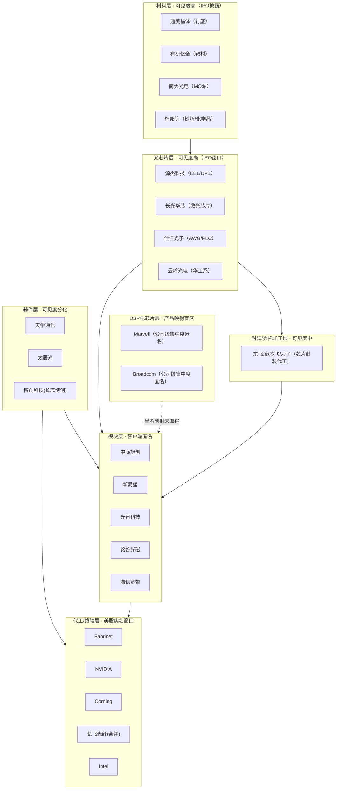

# 光模块产业结构：分层可验证图谱 v1.5

> v1.6 结构补全轮产物（2026-07-24 修复轮 v1.6r 重装后版本）。台账快照
> **236 边 / 169 节点**（v1.4 报告的 99/48 快照冻结不改）。本版回答彩排的原始
> 问题——**产业的结构**：本轮覆盖到材料—芯片—封装—器件—模块—终端的若干关键层
> （硅光工艺、连接器/PCB、封装材料等层未覆盖），每层标注公开可见度。首版装配
> 曾被整轮红队查出系统性单位错误（元误写万元40风险行）与序列串接错位，已按
> 单位继承原则整体重装；重装后固定种子随机抽样 10/10 通过（金额逐位命中）。
> 机械验证覆盖字段=对手方名+金额数字，方向/占比经抽样人工复核。
> 每句结论标注 [数据]/[推断]/[观察]。

## 结构总览（从上游到终端）

（设备/仪器层——猎奇、ficonTEC、联讯等——为贯穿各层的纵轴，见 v1.4 报告，本版不重复。）

## 各层结构与证据（本轮新增部分）

### 1. 材料层（16 个节点，v1.6 全新）

**[数据]** 三份 IPO 样本中光芯片的上游供应商表实名：源杰与长光华芯**共用衬底供应商
北京通美晶体**（源杰 2020-2022H1 占采购 7-18%，长光华芯 2018-2021H1 连续在列
——两份独立招股书互相印证同一上游节点）；靶材（有研亿金，双厂共用）、MO 源
（南大光电：磷烷/三甲基铟）、特气（大阳日酸/卫光/兴化）、光刻掩模（路维光电）。
**[观察]** 在本轮三份芯片厂 IPO 样本中，前五大材料供应商实名密度较高（未做
跨层实名率统计，不作"全链最高"断言）。

### 2. 光芯片层（10 个节点，v1.6 全新）

- **[数据] 源杰科技 IPO 窗口期（2019-2022H1）客户样本提供了一张国产通信激光芯片去向的局部历史切片**：中际旭创（旭创系合并
  口径 2020:18.19% → 2021:9.12%，2023-24 关联销售延续）、铭普光磁（2019:30.58%
  → 2021:14.78%）、储翰科技（2019:19.21%，2020 起并入旭创系口径）、海信宽带
  （2020:4.41%）、九州光电子、八界光电、蓉博通信。
- **[数据] 源杰的芯片封装委外**：东飞凌（2021 占委托加工 60.06%）、桂林芯飞、
  力子光电、芯思杰——**封装/委托加工是一个此前完全缺失的产业层**。
- **[数据] 长光华芯**的客户以工业激光为主（锐科、创鑫、飞博、大科、华日），
  2023-2025 年报关联销售延伸至镓锐芯光等。**[推断]** 其光通信（VCSEL/EML）业务
  在客户表中的对应关系尚无披露支撑，不入图。
- **[数据] 仕佳光子**双料：客户覆盖线缆系统集团（中天/亨通/中航光电/长飞）与
  海外（泰科电子、Fibracem、**Intel 及其代工厂**——2019 年 AWG 进入 Intel 硅光
  链的直接披露，E110）；供应商侧有长飞（光纤）、杜邦、中科院半导体所
  （2023-2025 研发/加工费与双向购销的实名关联交易信号——交易类别不足以证明
  "技术来源"，此处不作该断言）。

### 3. DSP 电芯片层（产品映射盲区，显式标注）

**[数据]** Broadcom FY2025 10-K：分销商占**公司整体**收入 48%（含基础设施软件
等多业务），前五终端客户合计约 40%，全部匿名；Marvell FY2026 10-K：直接客户 A
14%、分销商 A 37%，全部匿名（E233-E236 半边槽位，公司整体口径、非 DSP 专属，
flows/out/v16-dsp-layer.md）。**[推断]** 两份 10-K 不提供 DSP→模块厂的产品级
具名映射；叠加本项目覆盖的 A 股模块厂供应商表匿名，**截至 2026-07-24 本项目在
上述证据集内未取得任何具名 DSP 配套关系**（未对新闻稿/技术文档/拆机资料等其他
公开路径做穷尽检索，不作"无公开通路"的全称断言）。

### 4. 器件层新增：太辰光-Corning 与长飞系

- **[数据] 太辰光 2024 年报实名第一大客户 Corning Incorporated，占收入
  70.10%**（965,808,265.22 元，E165）——台账中单客户集中度最高的实名边。2025 年报
  重新匿名化（第一名 68.48%/10.59 亿元）。**[推断，B级]** 判例#007：2025 匿名
  第一名 = Corning（量级连续 70.10%→68.48%；单锚考古，封顶 B 级；2023 年
  35.70% 槽位量级不连续，不判定）。
- **[数据] 博创科技(2025 更名长芯博创)与长飞系 2023-2025 存在持续双向交易记录**：
  集团聚合口径（前五大表"长飞光纤合并"行）与长飞光纤光缆股份有限公司法人单体
  （关联交易表）已拆分为两类边、scope 逐边标注；另有诺基亚贝尔、Cloud Light
  客户边与 Kaiam 坏账死亡边（程序段落泄漏）。"绑定深度"不作断言——集团与单体
  分母不可比。

### 5. 模块层加宽的诚实结果

**[数据]** 华工科技年报的实名关联方绝大多数属激光装备业务；光模块子公司华工
正源只以集团内担保对象出现，其对外客户不可见——华工的光链证据仅云岭光电
（光芯片，双向）等 3 条入图，其余 50+ 条关联方按"非光链"显式剔除（裁剪清单
留档）。剑桥科技三年仅 2025 年出现一个缩写"HTI"（20.13%，全称未披露，不做
身份推断，E136）。**[观察]** 在本轮覆盖的年报样本中，模块厂前五大表多为匿名；该层空白至少部分
来自披露限制，也可能包含本项目样本与检索覆盖不足。

## 各层可见度总表

| 层 | 节点数(v1.5) | 具名边可得性 | 主要信源 | 盲区 |
|---|---|---|---|---|
| 材料 | 16 | 高 | 芯片厂IPO供应商表 | 无明显盲区 |
| 光芯片 | 10+ | 高（IPO窗口）| 招股书双侧实名+年报关联交易 | 上市后窗口收窄 |
| DSP电芯片 | 2 | 本项目证据集内未取得 | —— | 10-K集中度表无产品级映射(公司整体口径) |
| 封装/委外 | 4 | 中 | IPO委托加工表 | 仅IPO期可见 |
| 器件 | 15+ | 分化 | 年报（太辰光2024实名/2025匿名）| 窗口开合不定 |
| 模块 | 25+ | 低（客户端）| 前五大表匿名 | 云客户C级天花板 |
| 代工/终端 | —— | 中高 | 美股10-K | 供应商侧匿名 |
| 设备/仪器 | —— | 高（IPO）| 招股书+问询 | 上市后重新匿名 |

## 时效性边界（诚实声明）

**[数据]** 本轮 IPO 信源的报告期：源杰 2019-2022H1、仕佳 2017-2019、长光华芯
2018-2021H1——**芯片层的客户结构是 IPO 窗口期的历史快照**，此后份额可能已
变化（源杰 2023-2025 关联交易边提供部分延续，但覆盖不全）。台账逐边带年份，
引用时以边上年份为准，不得当作当前份额引用。

## 判例分布（v1.5 快照）

已完成判例：#002 PINEWAVE、#003 Ciena/Google/Apple/Nokia（A 级）；
#004 Fabrinet、**#007 太辰光-Corning（v1.6 新增）**（B 级）；#006 集团一
（C 级候选不点名）；#001/#005 未成判例。

## 从哪里继续核对

[edges.csv](edges.csv)（236 边）/ [nodes.csv](nodes.csv)（169 节点）/
[deanonymization-cases.md](deanonymization-cases.md)（判例库 2A+2B）/
[光模块产业图谱-v1.5.html](光模块产业图谱-v1.5.html)（分层交互图）/
`../flows/out/v16-extract-{codex,grok,sonnet}.md`（三路抽取原始记录，含未入图的
匿名槽位与剔除项）/ `../flows/out/v16-dsp-layer.md`（DSP 盲区判定）。
