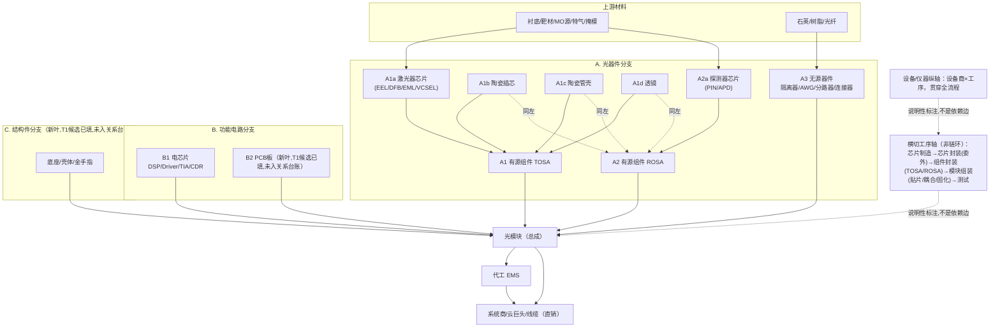

# 光模块供应链全景 v1.1 — 树 × 每节点公司名单（结构重排版）

> **本版性质**：本文件相对 `output/光模块供应链全景-v1.md`（保留不改）**只做结构重排**，
> 骨架据 Claude 终审定稿修复 v1 的线性化建模错误——v1 把"陶瓷插芯/陶瓷管壳/透镜"
> 与"隔离器/波分复用器/分路器/光纤连接器"混编为同一条"无源器件"链环，实际前者是
> 汇入 TOSA/ROSA 的并行支路（组件级子部件），后者是与 TOSA/ROSA 并列进入模块的
> 独立无源器件；v1 也把"芯片封装"处理成主链一环，实际它是横切全流程的工序，不是
> BOM 树上的一个节点层。**公司名单、锚、状态逐行照抄 v1，不增不删不改一字**；新增
> 的只有节点归属（放进哪一叶）与导航性文字，且每处归属改动均在下方"诚实边界"节
> 注明依据与核对结果。
>
> **分档准入**：每家公司标两档之一——①**有锚**（`output/nodes.csv`+`edges.csv`已收录，且在
> `flows/out/supply-chain-nodes-v0.md`或六路内容台账中能指认到具体产品/工序的 T1 引语，
> stance 标注发行人自述/同业描述/披露方产品列/竞品描述之一）；②**线索级待锚**（有名字但无
> 单源 T1 产品锚，或来自 `flows/out/pilot-s0a.md` 等尚未走判定闸的候选，不编造、不升格）。
> **双闸声明**：本文只回答"谁在哪个节点、做什么"，**不表达供货关系**——供货关系的唯一承重
> 台账是 `output/edges.csv`，本文"关系台账有边?"列仅如实标注该公司名是否已作为供方或需方
> 出现在 edges.csv 中，不代表该边证明了本节点所述的产品身份。
> **准入来源**：`flows/out/s0c-gap-grid.md`（12 叶子×覆盖×缺口）+ `flows/out/supply-chain-nodes-v0.md`
> （169 公司×做什么×锚）+ `output/nodes.csv`/`edges.csv`（台账基线 169 节点/236 边）+
> `flows/BOM-词表-v0.md` + `flows/out/pilot-s0a.md`（InP 衬底候选）+ 六路内容台账
> （`ledger-SJZ/CGHX/YJZ/C35/SJ24/TCG24.md`，产品构成/设备-工序能力类条目补充节点锚，
> 但 issuer_self 条目在此仅作"做什么"身份线索，不承重关系边，遵循与 supply-chain-nodes-v0
> 一致的准入纪律）+ `flows/out/s0a-local-hits.csv`/`flows/out/t9-gate-firstpass.md`（S0a本地
> 全词表扫描×判定闸首过分类=生产中,主会话终裁并入,2026-07-24）。生成日：2026-07-24。
>
> **S0a 本地扫描并入（本轮追加，2026-07-24）**：`flows/out/s0a-local-hits.csv` 本地全词表扫描
> 命中经 `flows/out/t9-gate-firstpass.md` 判定闸首过分类=生产中、主会话终裁后并入本文——
> 新增 11 家此前不在台账的新公司（弘景光电/生益电子/迅捷兴/博敏电子/东山精密/生益科技/
> 联特科技/长盈通/汇绿生态(武汉钧恒)/永鼎股份/东田微），另有 9 家已在台账公司在其现有
> 节点行追加新增生产能力备注（中际旭创/光迅科技/天孚通信/太辰光/三环集团/光库科技/
> 铭普光磁/长芯博创(博创科技)/仕佳光子）。均标"节点层宽闸,S0a并入,判定闸=生产中"，
> 未入关系台账，详见文末"空节点缺口任务汇总"S0a并入结果段与各叶内交叉引用。
>
> **S0a 本地扫描增量并入（本轮追加，2026-07-24）**：`flows/out/s0a-local-hits.csv` 增量
> 命中（244条，较首过184条新增60条）经 `flows/out/t9-gate-increment.md` 判定闸增量分类=
> 生产中、主会话终裁后并入本文——新增 1 家此前不在台账的新公司（优迅股份 [科创:688807]，
> B1 电芯片叶 TIA/跨阻放大器子槽，**新骨架下唯一真空叶自此填补**）。同轮另核对 32 家不在
> 台账的公司中 19 家新增判定单元（半导体语料批为主，"隔离器"系统性域外碰撞/TIA·TOSA字串
> 碰撞），除优迅股份外均不入 BOM 叶；13 家为与首过完全重复的判定单元，非本轮遗漏。标"节点
> 层宽闸,S0a增量并入,判定闸=生产中"，未入关系台账，详见文末"空节点缺口任务汇总"增量并入
> 结果段与 B1 节交叉引用。
>
> **怎么读——上市状态标注（本轮追加，2026-07-24）**：每个公司行的名称后新增 `[市场:代码]`
> 方括号标注，仅取自 `flows/out/s0b-candidates.csv`（66 家已识别上市/挂牌主体）与
> `output/nodes.csv` 代码列两个库内文件，不查外网、不猜；两源都能确定代码时以 `nodes.csv`
> 为准（本轮遇到的唯一实质冲突是已退市三家——Acacia/Infinera/NeoPhotonics——`nodes.csv`
> 记"已退市"更准确，s0b 的历史代码在标注中保留作"历史代码"注记，不覆盖已退市状态）；
> IPO 在途、已退市、新三板（含已摘牌）等非交易所代码状态原样标注（如 `[IPO在途:创业板]`
> `[已退市;历史代码NASDAQ:ACIA]`）；两源均未给出可确认代码（含 s0b 自身注明"状态未闭环/
> 市场不猜"的候选，以及本文新增的 T1/InP 线索级候选公司）一律标 `[未上市/未识别]`，不升格、
> 不外推。此标注只回答"是否已在公开市场挂牌"，与本文"关系台账有边?"列一样不表达供货关系。

## 0. 骨架图（mermaid，并行汇聚结构；模板/结构参照，非证据）



**文字骨架（与上图对应，替换 v1 §0 的线性 ASCII 图；东吴证券 BOM 树模板声明位置不变，仍为零次证据）**：

```
光模块（总成）由三条并行分支汇聚：
A. 光器件分支
   A1 有源组件 TOSA ←汇聚{A1a 激光器芯片(EEL/DFB/EML/VCSEL) + A1b 陶瓷插芯 + A1c 陶瓷管壳 + A1d 透镜}
   A2 有源组件 ROSA ←汇聚{A2a 探测器芯片(PIN/APD) + A1b-d 同左}
   A3 无源器件：隔离器 / 波分复用器AWG / 分路器 / 光纤连接器(MPO/FAU)
B. 功能电路分支
   B1 电芯片(DSP/Driver/TIA/CDR)  B2 PCB板(新叶,T1候选已填,未入关系台账)
C. 结构件分支(底座/壳体/金手指)(新叶,T1候选已填,未入关系台账)
上游材料层分别喂给叶子：衬底/靶材/MO源/特气/掩模→A1a·A2a；石英/树脂/光纤→A3
横切工序轴(单独一节,非链环)：芯片制造→芯片封装(委外)→组件封装(TOSA/ROSA)→模块组装(贴片/耦合/固化)→测试
设备/仪器纵轴：设备商×工序 映射保留
下游：模块→(直销/经代工EMS)→系统商/云/线缆
```

---

## A. 光器件分支

### A1 有源组件 TOSA（汇聚 A1a + A1b + A1c + A1d）

#### A1a 激光器芯片（EEL/DFB/EML/VCSEL）

> 行来自 v1 §2「光芯片」表；仅搬入身份依据明确指向"激光器芯片"的两行。

| 名称 | 身份依据一句 | 锚 | 关系台账有边? |
|---|---|---|---|
| N33 源杰科技 [科创:688498] | 光芯片的研发、设计、生产与销售（激光器芯片系列） | 有锚；发行人自述（招股书/年报主营句） | 有（E049→猎奇智能需方；E166/E168等多条→源杰为需方；E181起→源杰为供方） |
| N160 长光华芯 [科创:688048] | 半导体激光芯片、器件及模块等激光行业核心元器件的研发、生产与销售 | 有锚；发行人自述（招股书/年报）；CGHX内容台账补充：光纤耦合模块工艺流程含快轴/慢轴准直透镜组装（自用于封装，非透镜生产者） | 有（E201起→需方多条；E217起→供方多条） |

（另见 A2a：武汉云岭光电 N119/N120 身份依据同时含"激光器和探测器芯片"，不拆分整行，正行放于 A2a。）

#### A1b 陶瓷插芯

> 行来自 v1 §5.2；本轮已由"同业描述"升格为发行人自述直接产品锚。

| 名称 | 身份依据一句 | 锚 | 关系台账有边? |
|---|---|---|---|
| N104 太辰光 [创业:300570] | 光互联元件类别下的陶瓷插芯、MT插芯，用于保证光纤定位 | 有锚；发行人自述（2024年报产品应用表）："陶瓷插芯、MT 插芯｜保证光纤定位"（ledger-TCG24 TCG24-产品应用表段）——升级前仅有仕佳光子招股书竞品段"太辰光主营…陶瓷插芯、光纤连接器"的同业描述，本轮补齐发行人自身产品表直证 | 有（E165→Corning；E232→Corning(解匿)） |

> S0a本地扫描新增确认（2026-07-24,判定闸=生产中）：太辰光2025年报产品-功能对照表另有
> "PLC分路器｜实现光功率的分配"条目，坐实其同时具备PLC分路器生产能力（与上方陶瓷插芯锚
> 为同一节点N104不同产品线，不新增整行，来源 flows/out/s0a-local-hits.csv
> 300570__em_太辰光_em__2025_2025年年度报告.pdf）；同轮FAU命中为"FAU产品开发基本实现项目
> 目标"研发投入表表述，判定闸=拟生产，不构成生产中新增。

#### A1c 陶瓷管壳（T1并入候选，未入关系台账）

> 候选来自 `flows/out/t1-leaf-fill.md`〈建议终验并入〉，节点层宽闸候选，检索日期2026-07-24，尚未建立供货关系边。

| 名称 | 身份依据引语 | 锚URL | 状态 |
|---|---|---|---|
| 三环集团 [未上市/未识别] | "专为光芯片封装设计的高可靠性陶瓷管壳"及"陶瓷封装管壳等光通信产品已推向市场" | [2025年年度报告](https://static.cninfo.com.cn/finalpage/2026-03-28/1225041594.PDF) | 节点层宽闸,T1并入,未入关系台账 |
| 中瓷电子 [未上市/未识别] | "公司电子陶瓷系列产品包括光通信器件外壳" | [2023年年度报告](https://static.cninfo.com.cn/finalpage/2024-04-26/1219832754.PDF) | 节点层宽闸,T1并入,未入关系台账 |

> S0a本地扫描新增确认（2026-07-24,判定闸=生产中）：三环集团2025年报另有"公司陶瓷插芯
> 及配套产品销售额实现进一步增长"自述句，坐实其同时具备陶瓷插芯生产能力，与太辰光并列
> 成为该产品线第二家产销主体（与上方陶瓷管壳锚为同一节点不同产品线，不新增整行，不在
> A1b另立新行，来源 flows/out/s0a-local-hits.csv 300408__em_三环集团_em__2025_2025年年度
> 报告.pdf）。

> 原 v1 §5.5 近邻候选（未入本叶）：N12 天孚通信（类型=光器件/组件厂，命中"陶瓷套管/陶瓷插芯"，
> 未命中"陶瓷管壳"字样，常识候选无锚弃，详见 t1-leaf-fill.md 候选弃用节）；N138 深圳市宏钢机械
> 设备有限公司（产品列"盖板、壳体组等"→长光华芯，为激光器件壳体，未必等同于光模块陶瓷管壳）。

#### A1d 透镜（仍为部分/弱覆盖，无专产主体）

> 行来自 v1 §5.3。

| 名称 | 身份依据一句 | 锚 | 关系台账有边? |
|---|---|---|---|
| N143 炬光（东莞）微光学有限公司 [未上市/未识别] | 光学件 | 半锚；披露方产品列（长光华芯招股书外协采购表），未专锚"透镜/准直透镜"字样 | 有（E211→长光华芯） |
| N160 长光华芯 [科创:688048] | 光纤耦合模块封装工艺含快轴/慢轴准直透镜组装、光纤组装、耦合组装等步骤 | 弱锚；CGHX内容台账工序步骤条目（发行人自述封装流程），显示长光华芯**使用**准直透镜完成自身激光器件封装，不构成透镜**生产者**身份 | 有（同 A1a 节，与上一条为同一节点不同身份依据行） |
| N145 腾景科技股份有限公司 [科创:688195] | （类型）光器件 | 仅类型归层，待锚 | 有（E212→长光华芯，外协光学相关边） |
| 福晶科技 [未上市/未识别] | 精密光学元件涵盖……球面透镜、柱面透镜、非球面透镜，应用包括光通信波分复用器 | 部分证实；披露方产品列（[2025年年度报告](https://static.cninfo.com.cn/finalpage/2026-04-29/1225227139.pdf)），不宣称其透镜专供光模块，T1并入候选来自`flows/out/t1-leaf-fill.md` | 节点层宽闸,T1并入,未入关系台账 |

### A2 有源组件 ROSA（汇聚 A2a + A1b-d 同左，不重复列表）

#### A2a 探测器芯片（PIN/APD）

> 从 v1 §2「光芯片」表单列。台账候选按 v1 原文身份依据核对如下：
> - **武汉云岭光电（N119/N120）**：v1 原文身份依据为"光通信用激光器和探测器芯片（含封装类产品）"，
>   锚为"有锚；同业描述（源杰招股书同业段）"——**身份依据明确覆盖探测器芯片，予以归入**（同时
>   也覆盖激光器芯片，见 A1a 处的交叉引用，不重复整行）。
> - **武汉昱升光电（N122）**：v1 原文身份依据为"芯片封装（委托加工）"（见 v1 §3），**不含**探测器
>   芯片产品字样，核对后**不归入**本叶，保留在下方"横切工序轴 §芯片封装"节。
> - **武汉灿光光电（N124）**：v1 原文身份依据为"（类型）光/电芯片，仅类型归层，待锚"，无具体
>   探测器芯片指向，核对后**不归入**本叶，按"归属有疑义保守放其余光器件"处理，见下方
>   "A-其余光器件"节。

| 名称 | 身份依据一句 | 锚 | 关系台账有边? |
|---|---|---|---|
| N119 武汉云岭光电有限公司 [未上市/未识别] | 光通信用激光器和探测器芯片（含封装类产品） | 有锚；同业描述（源杰招股书同业段） | 有（E137/E141→华工科技） |
| N120 武汉云岭光电股份有限公司 [未上市/未识别(北证代码874775.BJ待闭环)] | 光通信用激光器和探测器芯片（含封装类产品） | 有锚；同业描述（源杰招股书同业段） | 有（E138/E142→华工科技） |

### A3 无源器件：隔离器 / 波分复用器AWG / 分路器 / 光纤连接器（MPO/FAU）

> 太辰光"光纤连接器为主业"（含 MPO/FAU 品类）已内嵌于下表太辰光身份依据一句中，
> 从 v1 §5.1 原样带入，不另立新行。仕佳光子身份依据一句同时覆盖 AWG + PLC分路器
> + 光纤连接器三类，一并列于此叶，不拆分重复。

#### 波分复用器 / AWG（本轮升级：仕佳光子已由"宽类型"升格为具体产品锚）

| 名称 | 身份依据一句 | 锚 | 关系台账有边? |
|---|---|---|---|
| N85 仕佳光子 [科创:688313] | 光芯片及器件（PLC分路器芯片系列、**AWG芯片系列产品**、DFB激光器芯片系列、光纤连接器）、室内光缆、线缆材料的研发、生产及销售 | 有锚；发行人自述，产品构成条目升级：招股书"仕佳光子主要产品包括光芯片及器件…AWG芯片系列产品…"（ledger-SJZ SJZ284/286）+ 2024年报"应用于400G和800G光模块的CWDM/LAN WDM AWG组件已实现大批量出货""60通道100GHz AWG…芯片及模块已在骨干及城域网…相干通信应用中实现批量出货"（ledger-SJ24 SJ24-32起）；供货边 E110 已确认对 Intel 的数据中心 AWG 器件批量销售（招股书原文，此边证据独立于本节点锚，双闸不混用） | 有（E110→Intel；E100/E101/E102等→需方） |
| N104 太辰光 [创业:300570] | 陶瓷插芯/光纤连接器为主业（AWG为在研项目，尚未量产） | 有锚（在研阶段）；发行人自述："AWG 芯片开发｜持续进行中｜产品实现批量产销"（ledger-TCG24 TCG24研发投入表，2024年报）——**注意**：这是在研项目，不构成"生产中"锚，仅作为该公司技术布局线索登记 | 有（E165→Corning；E232→Corning(解匿)） |

> 注：仕佳光子上一行的身份依据一句已包含"PLC分路器芯片系列"与"光纤连接器"，
> 视为对本叶"分路器"与"光纤连接器"两品类的同一行覆盖，不重复列行。

> S0a本地扫描新增确认（2026-07-24,判定闸=生产中）：仕佳光子2025年报另有"产品包括：……AWG、
> MT-FA、FAU等无源光组件系列产品"及"批量出货，项目完成……实现产业化……TOSA器件领域"表述，
> 进一步坐实其FAU/光纤阵列生产能力（见下方"光纤阵列/FAU"节交叉引用）与TOSA工序覆盖，
> 与上一行为同一节点N85不同产品条目，不新增整行，来源 flows/out/s0a-local-hits.csv
> （688313__em_仕佳光子_em__2025_2025年年度报告.pdf），经 `flows/out/t9-gate-firstpass.md`
> 判定闸首过、主会话终裁并入；同轮光隔离器/隔离器/TIA命中判定闸=无法判断（规格表主体
> 归属不清/TIA-EIA标准子串误命中），不构成新增。

#### 波分复用器 / AWG — S0a本地扫描并入（判定闸=生产中，2026-07-24）

> 候选来自 `flows/out/s0a-local-hits.csv` 本地全词表扫描命中，经 `flows/out/t9-gate-firstpass.md`
> 判定闸首过分类=生产中，主会话终裁并入，节点层宽闸，未入关系台账。

| 名称 | 身份判定引语 | 来源 | 状态 |
|---|---|---|---|
| 长盈通 [科创:688143] | "产品简介……AWG器件：CWDM及LAN WDM AWG器件具备小尺寸……低损耗和低成本特征" | S0a本地扫描2025年报（688143__em_长盈通_em__2025_2025年年度报告.pdf） | 节点层宽闸,S0a并入,判定闸=生产中 |
| 永鼎股份 [沪主板:600105] | "公司构建了覆盖'芯片-光器件-MPO'的全产业链体系，具备国内稀缺的IDM（集成器件制造）激光器FAB（晶圆制造）工厂……核心业务聚焦于三大类产品：……无源光器件：涵盖阵列波导光栅（AWG）、滤波片（Filter）、MT-FA（MT光纤阵列）、MUX/DEMUX（复用器/解复用器）组件，以及……环形器、隔离器、Z-BLOCK（Z型滤波片组件）等数据中心光模块关键组件" | S0a本地扫描2025年报（600105__em_永鼎股份_em__2025_永鼎股份2025年年度报告.pdf） | 节点层宽闸,S0a并入,判定闸=生产中（单行覆盖AWG/阵列波导光栅/光纤阵列MT-FA/隔离器四品类，另见本叶下方"光纤阵列/FAU"与"隔离器"两节交叉引用，不重复整行） |

#### 光纤阵列 / FAU — S0a本地扫描并入（判定闸=生产中，2026-07-24）

> 候选来自 `flows/out/s0a-local-hits.csv` 本地全词表扫描命中，经 `flows/out/t9-gate-firstpass.md`
> 判定闸首过分类=生产中，主会话终裁并入，节点层宽闸，未入关系台账。太辰光"光纤连接器为
> 主业"已内嵌于 A3 顶部说明，本节为 S0a 新增的独立光纤阵列/FAU 生产主体。

| 名称 | 身份判定引语 | 来源 | 状态 |
|---|---|---|---|
| 弘景光电 [创业:301479] | "凭借光学设计、精密制造等方面的优势，成功开发了多款光通信中的光无源器件（如非球面透镜、光纤阵列组件等）" | S0a本地扫描2025年报（301479__em_弘景光电_em__2025_2025年年度报告.pdf） | 节点层宽闸,S0a并入,判定闸=生产中 |
| 长盈通 [科创:688143] | "公司以发行股份及支付现金方式并购……快速构建起光模块用无源内连光器件和光纤阵列器件的研发、生产、销售能力" | S0a本地扫描2025年报（688143__em_长盈通_em__2025_2025年年度报告.pdf） | 节点层宽闸,S0a并入,判定闸=生产中 |
| 永鼎股份 [沪主板:600105] | 见上"波分复用器/AWG"节S0a并入表——同一引语覆盖AWG/阵列波导光栅/光纤阵列MT-FA/隔离器四品类，不重复整行 | 同上 | 交叉引用，不重复计入 |

#### 隔离器（T1并入候选，未入关系台账）

> 候选来自 `flows/out/t1-leaf-fill.md`〈建议终验并入〉，节点层宽闸候选，检索日期2026-07-24，尚未建立供货关系边。

| 名称 | 身份依据引语 | 锚URL | 状态 |
|---|---|---|---|
| 光库科技 [未上市/未识别] | "光通讯器件……主要产品包括隔离器" | [2023年年度报告](https://static.cninfo.com.cn/finalpage/2024-04-03/1219506244.PDF) | 节点层宽闸,T1并入,未入关系台账 |
| 天孚通信 [创业:300394] | "光无源器件包括……光隔离器等" | [2020年向特定对象发行股票募集说明书](https://static.cninfo.com.cn/finalpage/2020-08-03/1208119960.PDF) | 节点层宽闸,T1并入,未入关系台账 |

> 原 v1 §5.4 弱覆盖背景保留：BOM词表v0"隔离器"一词出处为猎奇招股书原材料构成（非具名
> 供应商）；仕佳招股书竞品段提及"光隔离器"品类未落为台账对手方节点；源杰招股书仅将光
> 隔离器定义为行业无源组件品类（"光无源组件…主要包括光隔离器、光分路器、光开关、光连接器、
> 光背板等"，ledger-YJZ YJZ440-442，industry stance，非具名生产商）；博创科技命中"光隔离器"
> 字样但仅见消费类AOC研发新品列举，未进入主营产品表，常识候选无锚弃，未入本叶。

> S0a本地扫描新增确认（2026-07-24,判定闸=生产中）：光库科技2025年报另有"密集光纤阵列
> 连接器""DR4/DR8FAU、单模/多模MT-MT跳线、MT-FAU……保偏型CPO用光纤阵列……多通道二维
> FAU系列"等自述产品条目，坐实其同时具备光纤阵列/FAU生产能力（与上方隔离器锚为同一
> 节点不同产品线，不新增整行，见下方"光纤阵列/FAU"节交叉引用，来源
> flows/out/s0a-local-hits.csv 300620__em_光库科技_em__2025_2025年年度报告.pdf）；天孚通信
> 同轮另有AWG/阵列波导光栅、BOSA、FAU/光纤阵列生产中新增确认，详见"A-其余光器件"节 N12
> 行备注，陶瓷插芯命中为释义定义句（判定闸=仅提及）、TIA为子公司名子串误命中（判定闸=
> 无法判断），不构成新增。

#### 隔离器 — S0a本地扫描并入（判定闸=生产中，2026-07-24）

> 候选来自 `flows/out/s0a-local-hits.csv` 本地全词表扫描命中，经 `flows/out/t9-gate-firstpass.md`
> 判定闸首过分类=生产中，主会话终裁并入，节点层宽闸，未入关系台账。本轮同时排除多起
> "域外碰撞"（中光防雷/武汉凡谷/华脉科技射频微波隔离器、聚飞光电光耦），均标"无法判断/
> 不适用"，不入本叶。

| 名称 | 身份判定引语 | 来源 | 状态 |
|---|---|---|---|
| 东田微 [创业:301183] | "已完成光隔离器、WDM滤光片及组件等多类产品的布局"；"在光隔离器、WDM滤光片等高端器件领域迅速跻身稀缺供应商行列" | S0a本地扫描2025年报（301183__em_东田微_em__2025_2025年年度报告.pdf） | 节点层宽闸,S0a并入,判定闸=生产中 |
| 永鼎股份 [沪主板:600105] | 见"波分复用器/AWG"节S0a并入表——同一引语覆盖AWG/阵列波导光栅/光纤阵列MT-FA/隔离器四品类，不重复整行 | 同上 | 交叉引用，不重复计入 |

### A-其余光器件（未细分至 A1/A2/A3 具体叶，仅类型归层）

> 合并 v1 §5.6 原 18 家 + 从 v1 §2「光芯片」表中"归属有疑义"迁入的 6 家（士兰微、三安光电、
> Intel、成都储翰科技、成都智禾光通、武汉灿光光电——均只有"仅类型归层，待锚"的通用
> 光/电芯片或半导体身份依据，无法坐实到 A1a 激光器芯片或 A2a 探测器芯片任一具体叶，
> 保守放本桶，不硬归），共 24 家。

| 名称 | 身份依据一句 | 锚 | 关系台账有边? |
|---|---|---|---|
| N04 Lumentum [NASDAQ:LITE] | （类型）光器件厂 | 仅类型归层，待锚 | 有（E005起多条） |
| N07 NeoPhotonics [已退市;历史代码NYSE:NPTN] | （类型）光器件厂(已消亡) | 仅类型归层，待锚 | 有（E008/E009） |
| N12 天孚通信 [创业:300394] | （类型）光器件/组件厂 | 仅类型归层，待锚 | 有（E043/E065/E066→Fabrinet） |
| N18 Coherent [NYSE:COHR] | 光器件/模块厂（类型跨层，本表暂归器件层） | 仅类型归层，待锚 | 有（E039-E042） |
| N46 士兰微 [沪主板:600460] | （类型）半导体IDM | 仅类型归层，待锚 | 有（E086→联讯仪器需方） |
| N48 三安光电 [沪主板:600703] | （类型）化合物半导体/光芯片 | 仅类型归层，待锚 | 有（E091/E095→联讯仪器需方） |
| N58 Intel(含其代工厂) [NASDAQ:INTC] | （类型）光/电芯片 | 仅类型归层，待锚 | 有（E110→仕佳光子需方） |
| N70 上海宽捷光电科技有限公司 [未上市/未识别] | （类型）光器件 | 仅类型归层，待锚 | 有（E203→长光华芯） |
| N76 东莞福可喜玛通讯科技有限公司 [未上市/未识别] | （类型）光器件 | 仅类型归层，待锚 | 有（E103/E115→仕佳光子） |
| N95 博创科技 [创业:300548] | 光通信领域集成光电子器件的研发、生产和销售 | 有锚；发行人自述（2024年报） | 有（E145起多条） |
| N96 博创科技股份有限公司 [创业:300548] | 光通信领域集成光电子器件的研发、生产和销售 | 有锚；发行人自述（2024年报） | 有（E186→源杰科技需方） |
| N98 四川乐飞光电科技有限公司 [未上市/未识别] | （类型）光器件 | 仅类型归层，待锚 | 有（E156→博创科技） |
| N100 四川光恒通信技术有限公司 [未上市/未识别] | （类型）光器件 | 仅类型归层，待锚 | 有（E151/E157→博创科技） |
| N101 四川飞普科技有限公司 [未上市/未识别] | （类型）光器件 | 仅类型归层，待锚 | 有（E152/E158→博创科技） |
| N105 常州太平通讯科技有限公司 [未上市/未识别] | （类型）光器件 | 仅类型归层，待锚 | 有（E120→仕佳光子） |
| N109 成都储翰科技 [新三板(已摘牌):831964] | （类型）光/电芯片 | 仅类型归层，待锚；entity-evidence-q3 确认仍在旭创系（2025-10旭光电子转让32.55%股权予中际旭创） | 有（E188→源杰科技需方） |
| N111 成都智禾光通(原成都旭创科技) [未上市/未识别] | （类型）光/电芯片 | 仅类型归层，待锚；entity-evidence-q3：2023年报"成都旭创"本期数与2024年报"智禾"上期数逐位一致，推断同主体更名/承继（B级） | 有（E189→源杰科技需方） |
| N114 普利技术潜江有限公司 [未上市/未识别] | （类型）光器件 | 仅类型归层，待锚 | 有（E160→博创科技） |
| N123 武汉正源高理光学有限公司 [未上市/未识别] | （类型）光器件 | 仅类型归层，待锚 | 有（E139/E143→华工科技） |
| N124 武汉灿光光电有限公司 [未上市/未识别] | （类型）光/电芯片 | 仅类型归层，待锚 | 有（E123/E133→仕佳光子） |
| N130 波若威光纤通讯有限公司 [未上市/未识别] | （类型）光器件 | 仅类型归层，待锚 | 有（E125→仕佳光子） |
| N142 湖北瑞创信达光电有限公司 [未上市/未识别] | （类型）光器件 | 仅类型归层，待锚 | 有（E140/E144→华工科技） |
| N151 苏州环明电子科技有限公司 [未上市/未识别] | （类型）光器件 | 仅类型归层，待锚 | 有（E213→长光华芯） |
| N154 苏州镓锐芯光科技有限公司 [未上市/未识别] | （类型）光/电芯片 | 仅类型归层，待锚 | 有（E215/E228→长光华芯） |
| N157 郑州仕佳通信科技有限公司 [未上市/未识别] | 光芯片及器件、室内光缆、线缆材料研发生产销售（仕佳体系主体） | 有锚（弱）；发行人自述母名主营外延至同名体系 | 有（E127→仕佳光子） |

> S0a本地扫描新增确认（2026-07-24,判定闸=生产中）：N12 天孚通信2025年报"AWG器件｜波分
> 复用｜<2.0dB｜>30dB"产品规格表条目，坐实AWG/阵列波导光栅生产能力（见A3"波分复用器/
> AWG"节S0a并入表交叉引用）；同规格表体系覆盖BOSA（组件封装工序覆盖，见横切工序轴节）；
> "FAU光线阵列设计与制造技术平台"坐实FAU/光纤阵列生产能力（见A3"光纤阵列/FAU"节交叉
> 引用）。"陶瓷插芯指……是光纤连接器的核心部件"为释义定义句，判定闸=仅提及，不构成新增
> 产锚（与太辰光已确认陶瓷插芯不同源）；TIA命中为子公司名"天孚之星/TIANFU INTERNATIONAL
> INVESTMENT"子串误命中，判定闸=无法判断。N95/N96 长芯博创（原博创科技）2025年报"……
> MEMS可调光衰减器（VOA）以及广泛应用于各种光器件中的光纤阵列等；应用于数据通信……的
> 产品包括……光模块"判定闸=生产中，坐实光纤阵列生产能力（见A3"光纤阵列/FAU"节交叉
> 引用）；"AWG指ArrayedWaveguideGrating阵列波导光栅"为释义定义句，判定闸=仅提及，不构成
> 新增。以上来源 flows/out/s0a-local-hits.csv（300394__em_天孚通信_em__2025_2025年年度
> 报告.pdf；300548__em_长芯博创_em__2025_2025年年度报告.pdf），经
> `flows/out/t9-gate-firstpass.md` 判定闸首过、主会话终裁并入，不新增整行，仅作节点行备注。

---

## B. 功能电路分支

### B1 电芯片（DSP / 激光驱动 Driver / 限幅放大 TIA / 时钟恢复 CDR）

> 行与honesty段落原样来自 v1 §4，位置不变，仅分支编号从 L3 改记为 B1。

| 名称 | 身份依据一句 | 锚 | 关系台账有边? |
|---|---|---|---|
| N05 Acacia [已退市;历史代码NASDAQ:ACIA] | （类型）相干光器件/DSP | 仅类型归层，待锚 | 有（E006→Fabrinet需方） |
| N15 博通(Broadcom) [NASDAQ:AVGO] | PHY/光组件："AI semiconductor solutions include…physical layer devices (PHYs) and optical components"；"We supply a wide array of optical components" | FY2025 10-K产品段(sec.gov avgo-20251102.htm,共识结构层补锚2026-07-24) | 有（E011/E094→需方；E235/E236→供方匿名槽位） |
| N62 Marvell [NASDAQ:MRVL] | DSP+Driver+TIA全覆盖："interconnect products include PAM, coherent and coherent-lite DSPs, laser drivers, TIAs, silicon photonics, CPO, LPO chipsets" | FY2026 10-K产品段(sec.gov mrvl-20260131.htm,补锚2026-07-24) | 有（E233/E234→供方匿名槽位） |
| N73 上海橙科微电子科技有限公司 [未上市/未识别] | （类型）光/电芯片；**常识候选:光通信DSP/CDR厂商,待披露锚核实** | 仅类型归层，待锚 | 有（E182→源杰科技需方） |

**子槽状态更新(2026-07-24补锚)**：DSP/Driver/TIA 三子槽由 Marvell 10-K 产品段一句锚齐(海外主体)；Broadcom PHY/光组件锚齐；**国产主体仍全空**——这是叶内真正的结构事实。原诚实缺口记录保留如下：
上表 4 家均"仅类型归层，待锚"，无一家有具名产品锚指向 Driver/TIA/CDR/DSP。仕佳光子招股书
"硅光系列（相干光收发芯片、高速调制器、光开关等芯片；TIA、LDDriver、CDR 芯片）"一句
（ledger-SJZ SJZ35）经核实为**行业产品分类表**，条目本身明确"仕佳光子未披露硅光系列自有
产品"，不得作为仕佳光子生产 TIA/Driver/CDR 的身份锚。**未识别到公开可锚的专产主体**。
定向任务：①模块厂/设备商供应商表产品列筛"Driver/TIA/CDR"具名发行人；②Broadcom/Marvell
10-K 产品段补节点层"做什么"锚（禁止把客户集中度半边槽位误读为产品锚，参见 E233/E234/E235/E236
备注"非DSP专属槽位"）。

> **B1 增量更新（2026-07-24，t9-gate-increment.md）**：上段"国产主体仍全空"的结论由本轮
> S0a 增量判定闸更新——见下方"B1 本地扫描并入"小节，优迅股份（688807）填补该真空叶，
> 定向任务①（模块厂供应商表筛具名发行人）已由本地全词表扫描独立命中同一结论验证。

#### B1 电芯片 — S0a本地扫描并入（判定闸=生产中，2026-07-24）

> 候选来自 `flows/out/s0a-local-hits.csv` 本地全词表扫描命中，经 `flows/out/t9-gate-increment.md`
> 判定闸增量分类=生产中，主会话终裁并入，节点层宽闸，未入关系台账。这是新骨架下 B1 叶
> 自 T1/S0a 首过两轮并入均未触及以来的**首个填充主体**。

| 名称 | 身份判定引语 | 来源 | 状态 |
|---|---|---|---|
| 优迅股份 [科创:688807] | "优迅股份作为国内光通信电芯片领域的领军企业……专注于光通信前端收发电芯片的研发、设计与销售"；核心技术集群表自述"高带宽、低噪声、宽动态跨阻放大器设计技术"技术来源=自研/技术所处阶段=成熟应用/对应产品类型="高速率跨阻放大器芯片"；50G PON段"产品覆盖TIA、DRIVER及配套辅助芯片全品类"；1.6T段"研发跨阻放大器、VCSEL激光器驱动器……等核心产品" | S0a本地扫描2025年报（688807__em_优迅股份_em__2025_优迅股份：2025年年度报告.pdf），全文扩看核实 | 节点层宽闸,S0a并入,判定闸=生产中（TIA/跨阻放大器子槽；同年报另有Driver/CDR两项自研成熟应用自述，超出本轮命中词"TIA/跨阻放大"范围，未单独立判定单元，见t9-gate-increment.md §2附带发现，供后续定向补判） |

> 同轮优迅股份 BOSA 命中（释义句"BOSA指Bi-DirectionalOpticalSub-Assembly"+行业市场数据句
> "接入光模块和BOSA市场在2025年出货量达2.01亿"）判定闸=仅提及，优迅股份为电芯片(Fabless
> 设计)厂商非BOSA(光器件)厂商，不构成横切工序轴"组件封装(BOSA)"新增产锚。

### B2 PCB板（T1并入候选，未入关系台账）

> 候选来自 `flows/out/t1-leaf-fill.md`〈建议终验并入〉，节点层宽闸候选，检索日期2026-07-24，尚未建立供货关系边。
> v1 全篇未收录任何以 PCB 板为具名产品锚的公司节点，`flows/out/s0c-gap-grid.md` 12 叶盘格与
> `flows/BOM-词表-v0.md` 均未覆盖此叶；本叶为本轮 T1 首次填补。

| 名称 | 身份依据引语 | 锚URL | 状态 |
|---|---|---|---|
| 景旺电子 [未上市/未识别] | "800G光模块等高速PCB产品已实现量产" | [2024年年度报告](https://static.cninfo.com.cn/finalpage/2025-04-29/1223377812.PDF) | 节点层宽闸,T1并入,未入关系台账 |
| 四会富仕 [未上市/未识别] | "应用于光通信的800G光模块PCB等新型产品" | [2024年年度报告](https://static.cninfo.com.cn/finalpage/2025-03-29/1222948563.PDF) | 节点层宽闸,T1并入,未入关系台账 |
| 本川智能 [未上市/未识别] | "高频高速产品已在光模块客户中实现小批量出货" | [2025年年度报告](https://static.cninfo.com.cn/finalpage/2026-04-29/1225228204.PDF) | 节点层宽闸,T1并入,未入关系台账,小批量,成熟度低 |

#### B2 PCB板 — S0a本地扫描并入（判定闸=生产中，2026-07-24）

> 候选来自 `flows/out/s0a-local-hits.csv` 本地全词表扫描命中，经 `flows/out/t9-gate-firstpass.md`
> 判定闸首过分类=生产中，主会话终裁并入，节点层宽闸，未入关系台账。

| 名称 | 身份判定引语 | 来源 | 状态 |
|---|---|---|---|
| 生益电子 [科创:688183] | "研究开发高速光模块PCB产品，并实现产业化"（同段落，版面顺序有错位） | S0a本地扫描2025年报（688183__em_生益电子_em__2025_生益电子2025年年度报告.pdf） | 节点层宽闸,S0a并入,判定闸=生产中 |
| 迅捷兴 [科创:688655] | "公司完成任意互联HDI结构的800G光模块PCB、1.6T光模块PCB技术研发"；"400G光模块PCB生产工艺技术自主研发" | S0a本地扫描2025年报（688655__em_迅捷兴_em__2025_2025年年度报告.pdf） | 节点层宽闸,S0a并入,判定闸=生产中 |
| 博敏电子 [沪主板:603936] | "已实现400G、800G光模块PCB批量供货，同时积极推动1.6T光模块PCB量产工作" | S0a本地扫描2025年报（603936__em_博敏电子_em__2025_博敏电子2025年年度报告.pdf） | 节点层宽闸,S0a并入,判定闸=生产中 |
| 生益科技 [沪主板:600183] | "研究开发高速光模块PCB产品制作工艺技术，攻克技术难点，并实现产业化" | S0a本地扫描2025年报（600183__em_生益科技_em__2025_生益科技2025年年度报告.pdf） | 节点层宽闸,S0a并入,判定闸=生产中 |

---

## C. 结构件分支（底座/壳体/金手指）（T1并入候选，未入关系台账）

> 候选来自 `flows/out/t1-leaf-fill.md`〈建议终验并入〉，节点层宽闸候选，检索日期2026-07-24，尚未建立供货关系边。
> 注意本叶与 A1c「陶瓷管壳」不同层级——A1c 指向 TOSA/ROSA 组件级的陶瓷管壳，本叶指向
> 模块级结构件（模块外壳底座、金手指连接器等）。近邻信息：A1c 节 N138 深圳市宏钢机械
> 设备有限公司（产品列"盖板、壳体组等"→长光华芯）为激光器件壳体，层级同样偏组件级，
> 不构成模块结构件专产锚，不重复搬入本叶。

| 名称 | 身份依据引语 | 锚URL | 状态 |
|---|---|---|---|
| 斯瑞新材 [未上市/未识别] | "光模块芯片基座/壳体"为主要产品；"目前已实现壳体批量供应" | [2025年年度报告](https://static.cninfo.com.cn/finalpage/2026-04-28/1225214766.PDF) | 节点层宽闸,T1并入,未入关系台账 |

---

## 光模块（总成）— 三分支汇聚节点（L6，27 家）

> 行来自 v1 §7，原样搬入，位置不变——本节即骨架图中 A/B/C 三分支汇聚而成的"光模块（总成）"节点。

| 名称 | 身份依据一句 | 锚 | 关系台账有边? |
|---|---|---|---|
| N10 中际旭创 [创业:300308] | （类型）光模块厂 | 仅类型归层，待锚 | 有（E044起多条，供方/需方均有） |
| N11 新易盛 [创业:300502] | （类型）光模块厂 | 仅类型归层，待锚 | 有（E015起多条） |
| N19 Applied Optoelectronics(AAOI) [NASDAQ:AAOI] | （类型）光模块厂 | 仅类型归层，待锚 | 有（E017起多条；边中作"AAOI"） |
| N31 索尔思(Source Photonics) [未上市/未识别] | （类型）光模块厂 | 仅类型归层，待锚 | 有（E047→猎奇智能需方） |
| N32 光迅科技 [深主板:002281] | 光收发模块、有源光缆、光放大器、波长管理器件、光通信器件、子系统等 | 有锚；发行人自述（2023年报） | 有（E048/E074/E075起） |
| N47 海信集团 [未上市/未识别] | （类型）光模块/宽带(海信宽带) | 仅类型归层，待锚；entity-evidence-q3：海信宽带确认为海信集团全资子公司（2003年海信集团控股+TransLight共设），置信中 | 有（E087/E089/E092→联讯仪器需方） |
| N49 ALFAFONET ENDUSTRIYEL TELEKOM URUNLERI A.S. [未上市/未识别] | （类型）模块/光电子商 | 仅类型归层，待锚 | 有（E106→仕佳光子） |
| N51 Cloud Light Technology Limited [未上市/未识别] | （类型）模块/光电子商 | 仅类型归层，待锚 | 有（E148→博创科技） |
| N54 FOSTEC [未上市/未识别] | （类型）模块/光电子商 | 仅类型归层，待锚 | 有（E107→仕佳光子） |
| N55 Fibracem Teleinformática Ltda. [未上市/未识别] | （类型）模块/光电子商 | 仅类型归层，待锚 | 有（E108→仕佳光子） |
| N59 KUMPULAN ABEX SDN BHD [未上市/未识别] | （类型）模块/光电子商 | 仅类型归层，待锚 | 有（E111→仕佳光子） |
| N60 Kaiam Corporation [未上市/未识别] | （类型）模块/光电子商 | 仅类型归层，待锚 | 有（E146→博创科技，坏账核销/关系已死亡） |
| N65 Out Line S.r.l. [未上市/未识别] | （类型）模块/光电子商 | 仅类型归层，待锚 | 有（E112→仕佳光子） |
| N66 PRIME WORLD INTERNATIONAL HOLDINGS LTD. [未上市/未识别] | （类型）模块/光电子商 | 仅类型归层，待锚 | 有（E113→仕佳光子） |
| N67 SHARPNFLAT INC [未上市/未识别] | （类型）模块/光电子商 | 仅类型归层，待锚 | 有（E114→仕佳光子） |
| N68 上海八界光电科技有限公司 [未上市/未识别] | （类型）模块/光电子商 | 仅类型归层，待锚 | 有（E181→源杰科技需方） |
| N77 东莞铭普光磁股份有限公司 [深主板:002902] | （类型）模块/光电子商 | 仅类型归层，待锚 | 有（E183→源杰科技需方） |
| N87 全科科技有限公司 [未上市/未识别] | （类型）模块/光电子商 | 仅类型归层，待锚 | 有（E185→源杰科技需方） |
| N99 四川九州光电子技术有限公司 [未上市/未识别] | （类型）模块/光电子商 | 仅类型归层，待锚 | 有（E187→源杰科技需方） |
| N107 德国罗森博格通讯有限公司 [未上市/未识别] | （类型）模块/光电子商 | 仅类型归层，待锚 | 有（E121→仕佳光子） |
| N112 成都蓉博通信技术有限公司 [未上市/未识别] | （类型）模块/光电子商 | 仅类型归层，待锚 | 有（E190→源杰科技需方） |
| N113 成都迪谱光电科技有限公司 [未上市/未识别] | （类型）模块/光电子商 | 仅类型归层，待锚 | 有（E191→源杰科技需方） |
| N127 汇聚科技（惠州）有限公司 [未上市/未识别] | （类型）模块/光电子商 | 仅类型归层，待锚 | 有（E124→仕佳光子） |
| N136 深圳市亚美斯通电子有限公司 [未上市/未识别] | （类型）模块/光电子商 | 仅类型归层，待锚 | 有（E192→源杰科技需方） |
| N148 苏州旭创科技有限公司 [未上市/未识别] | （类型）模块/光电子商 | 仅类型归层，待锚 | 有（E193→源杰科技需方） |
| N165 青岛海信宽带多媒体技术有限公司 [未上市/未识别] | （类型）模块/光电子商 | 仅类型归层，待锚 | 有（E194→源杰科技需方） |
| N169 香港新南利 [未上市/未识别] | （类型）模块/光电子商 | 仅类型归层，待锚 | 有（E129→仕佳光子） |

#### 光模块（总成）— S0a本地扫描并入（判定闸=生产中，2026-07-24）

> 候选来自 `flows/out/s0a-local-hits.csv` 本地全词表扫描命中，经 `flows/out/t9-gate-firstpass.md`
> 判定闸首过分类=生产中，主会话终裁并入，节点层宽闸，未入关系台账。

| 名称 | 身份判定引语 | 来源 | 状态 |
|---|---|---|---|
| 武汉钧恒科技有限公司（汇绿生态[深主板:001267]控股51%子公司，2025-01-31并表） | "武汉钧恒为公司的控股子公司，武汉钧恒2012年成立，总部位于武汉光谷，专业从事以光模块为主的光通信产品的研发、制造和销售"；"光模块业务的营业收入比重大于50%" | S0a本地扫描2025年报（001267__em_汇绿生态_em__2025_2025年年度报告.pdf）；管理层讨论与分析·一、报告期内公司从事的主要业务 | 节点层宽闸,S0a并入,判定闸=生产中（口径限定：光模块总成，非TOSA/ROSA/跨阻放大器独立部件生产判定，另见横切工序轴组件封装TOSA/ROSA节交叉引用） |

> S0a本地扫描新增确认（2026-07-24）：N10 中际旭创2025年报"光模块主要由光发射组件TOSA、
> 光接收组件ROSA、电路板PCBA……构成"——描述自身光模块内部结构，判定闸=生产中，口径限定
> 为整机内部结构说明，非独立部件产能声明；同年报"电芯片包括DSP芯片、激光驱动器（LDD）、
> 跨阻放大器（TIA）、时钟数据恢复芯片（CDR）等，其中200G及以上速率的供应商主要在海外"
> 判定闸=采购使用（中际旭创为采购方非生产方，不构成B1电芯片新增产锚，B1仍为真空叶）。
> N32 光迅科技2025年报另有"无源光器件产品包括AWG（阵列波导光栅）……"与"产品有XGSPON&
> GPONOLT/ONU的BOSA"两条判定闸=生产中新增确认，坐实其AWG（见A3"波分复用器/AWG"节S0a
> 并入表交叉引用）与BOSA（组件封装工序覆盖，见横切工序轴节）双重能力，不改变N32本节点
> 归属。N77 东莞铭普光磁2025年报"光器件系列产品包括TOSA、BOSA、TriOSA、QOSA和ComboBOSA"
> 判定闸=生产中，填补N77原"仅类型归层，待锚"缺口，坐实其TOSA/BOSA组件封装能力（详见
> 横切工序轴节交叉引用）。以上三条来源 flows/out/s0a-local-hits.csv 对应文件
> （300308__em_中际旭创_em__2025_2025年年度报告.pdf；002281__em_光迅科技_em__2025_2025年
> 年度报告.pdf；002902__em_铭普光磁_em__2025_2025年年度报告.pdf），经
> `flows/out/t9-gate-firstpass.md` 判定闸首过、主会话终裁并入，不新增整行，仅作节点行备注。

---

## 上游材料（分喂 A 分支各叶）

### 材料 → A1a·A2a（芯片衬底/靶材/MO源/特气/光刻掩模类，13 家）

> 从 v1 §1（25家）中按身份依据一句的材料类型拆出：衬底、靶材、MO源（金属有机物）、
> 特气、光刻/显影相关材料、光刻掩模板，均服务于芯片制造工序（喂给 A1a 激光器芯片、
> A2a 探测器芯片两叶）。

| 名称 | 身份依据一句 | 锚 | 关系台账有边? |
|---|---|---|---|
| N61 Maruwa Co.,Ltd [未上市/未识别] | 热沉 | 有锚；披露方产品列（长光华芯招股书供应商表） | 有（E201→长光华芯） |
| N69 上海函泰电子科技有限公司 [未上市/未识别] | 显影液、增粘剂、光刻胶等 | 有锚；披露方产品列（源杰招股书供应商表） | 有（E166→源杰科技） |
| N84 京瓷（中国）商贸有限公司 [未上市/未识别] | 热沉 | 有锚；披露方产品列（长光华芯招股书供应商表） | 有（E204→长光华芯） |
| N93 北京通美晶体 [未上市/未识别] | 衬底（InP等晶圆衬底） | 有锚；披露方产品列（源杰/长光华芯招股书供应商表）；另 pilot-s0a 确认其现行 InP substrate 供货（AXT 2026-06-17 Form 8-K） | 有（E168→源杰科技；E205→长光华芯） |
| N103 大阳日酸特殊气体（上海）有限公司 [未上市/未识别] | 磷化氢、砷化氢 | 有锚；披露方产品列（源杰招股书供应商表） | 有（E170→源杰科技） |
| N115 有研亿金新材料有限公司 [未上市/未识别] | 金靶、铂靶、金锗靶等/贵金属蒸发材料 | 有锚；披露方产品列（源杰/长光华芯招股书供应商表） | 有（E172→源杰科技；E206→长光华芯） |
| N128 江苏南大光电材料股份有限公司 [创业:300346] | 磷烷、三甲基铟、三甲基镓等 | 有锚；披露方产品列（源杰招股书供应商表）；pilot-s0a 三甲基铟检索确认其为核心生产主体 | 有（E175→源杰科技） |
| N129 泛孟新材料（上海）有限公司 [未上市/未识别] | 异丙醇、光刻胶去除液 | 有锚；披露方产品列（源杰招股书供应商表） | 有（E176→源杰科技） |
| N131 泰库尼思科电子（苏州）有限公司 [未上市/未识别] | 热沉 | 有锚；披露方产品列（长光华芯招股书供应商表） | 有（E207→长光华芯） |
| N140 深圳市路维光电股份有限公司 [科创:688401] | 光刻掩模板 | 有锚；披露方产品列（源杰招股书供应商表） | 有（E179→源杰科技） |
| N155 西安卫光气体有限公司 [未上市/未识别] | 氮气、氢气、氧气、氩气等 | 有锚；披露方产品列（源杰招股书供应商表） | 有（E196→源杰科技） |
| N156 诺力昂化学品（宁波）有限公司 [未上市/未识别] | 金属有机物（MO源类） | 有锚；披露方产品列（源杰招股书供应商表） | 有（E197→源杰科技） |
| N163 陕西兴化集团有限责任公司 [未上市/未识别] | 氢气、氮气 | 有锚；披露方产品列（源杰招股书供应商表） | 有（E198→源杰科技） |

#### InP 衬底线索级候选（未入 nodes.csv/edges.csv，来自 `flows/out/pilot-s0a.md` S0a 试点，仅供后续判定闸参考）

> 从 v1 §1.1 原样搬入，同样喂给 A1a·A2a 叶。

| 名称 | 身份依据一句 | 锚 | 关系台账有边? |
|---|---|---|---|
| 珠海鼎泰芯源晶体有限公司 [未上市/未识别] | InP衬底单晶材料的研发、生产及销售 | 线索级待锚；历史交叉锚（cninfo 2021-06-26），当期 Wind 未返回，需 owner 核对量产连续性 | 否，候选未入台账 |
| 青岛立昂晶电半导体科技有限公司 [未上市/未识别] | 掌握2/3英寸磷化铟衬底生产技术，已实现小批量交付 | 线索级待锚；框架协议锚（cninfo 2026-06-22），小批量交付发生在资产转让前，连续性待终裁 | 否，候选未入台账 |
| 江苏兴光半导体有限公司 [未上市/未识别] | 收购磷化铟衬底制造与销售业务（拟生产） | 线索级待锚；同上框架锚，收购后需备案/环评/安评方可生产 | 否，候选未入台账 |
| 云南鑫耀半导体材料有限公司（云南锗业体系） [未上市/未识别] | 2025年生产磷化铟晶片10.01万片 | 线索级待锚；云南锗业2026-05-11投资者关系记录，上市披露主体与实际生产主体需分层建实体 | 否，候选未入台账 |
| 江苏光铟半导体有限公司（拟设） [未上市/未识别] | 从事磷化铟衬底的研发生产销售（拟设项目） | 线索级待锚；上交所监管交叉锚，合作方被监管指出无实际业务，高风险待闸 | 否，候选未入台账 |

#### InP 衬底 — S0a本地扫描并入（判定闸=生产中，2026-07-24，区别于上方线索级候选）

> 候选来自 `flows/out/s0a-local-hits.csv` 本地全词表扫描命中，经 `flows/out/t9-gate-firstpass.md`
> 判定闸首过分类=生产中，主会话终裁并入，节点层宽闸，未入关系台账。与上方"线索级候选"
> 不同——本条为发行人2025年报明确自述其控股子公司具备InP衬底全流程能力，非语义召回样本。

| 名称 | 身份判定引语 | 来源 | 状态 |
|---|---|---|---|
| 东山精密 [深主板:002384]（控股子公司索尔思光电，即已有节点N31） | "索尔思光电拥有覆盖磷化铟衬底、外延材料至光芯片的全流程研发与工艺体系，技术壁垒持续夯实" | S0a本地扫描2025年报（002384__em_东山精密_em__2025_2025年年度报告.pdf） | 节点层宽闸,S0a并入,判定闸=生产中（索尔思光电已作为N31出现于"光模块（总成）"节，本条为东山精密2025年报披露其磷化铟衬底全流程能力，补充N31身份线索，不改变N31原归属，东山精密本身不重复建节点） |

> 同轮东山精密"时钟恢复"命中为DSP释义定义句（"DSP……对高速电信号进行均衡、纠错、时钟
> 恢复、信号整形……是400G及以上高速光模块必备核心电芯片"），判定闸=仅提及，不构成B1
> 电芯片新增产锚。

### 材料 → A3（石英/树脂/光纤等无源器件材料，6 家）

| 名称 | 身份依据一句 | 锚 | 关系台账有边? |
|---|---|---|---|
| N64 OharaQuartzCo.,Ltd. [未上市/未识别] | 石英片 | 有锚；披露方产品列（仕佳光子招股书供应商表） | 有（E100→仕佳光子） |
| N71 上海普恩化工有限公司 [未上市/未识别] | EVA树脂 | 有锚；披露方产品列（仕佳光子招股书供应商表） | 有（E101→仕佳光子） |
| N72 上海景仓通信技术有限公司 [未上市/未识别] | 光纤 | 有锚；披露方产品列（仕佳光子招股书供应商表） | 有（E102→仕佳光子） |
| N108 成都中住光纤有限公司 [未上市/未识别] | 光纤 | 有锚；披露方产品列（仕佳光子招股书供应商表） | 有（E130→仕佳光子） |
| N116 杜邦(含关联方) [未上市/未识别] | 芳纶纱 | 有锚；披露方产品列（仕佳光子招股书供应商表） | 有（E131→仕佳光子） |
| N133 洛阳中超新材料股份有限公司 [未上市/未识别] | 氢氧化铝 | 有锚；披露方产品列（仕佳光子招股书供应商表） | 有（E134→仕佳光子） |

### 材料对象未细分（仅类型归层，待锚，无法判定具体喂入叶子，6 家）

> 身份依据一句仅为"（类型）材料/设备供应商"等宽类型描述，无法判定具体喂给
> A1a·A2a 还是 A3，保守不细分，原样列出。

| 名称 | 身份依据一句 | 锚 | 关系台账有边? |
|---|---|---|---|
| N35 奥普瑞 [未上市/未识别] | （类型）加工件供应商 | 仅类型归层，待锚 | 有（E052→猎奇智能） |
| N132 泰科电子(含关联方) [NYSE:TEL] | （类型）材料/设备供应商 | 仅类型归层，待锚 | 有（E126→仕佳光子） |
| N135 深圳市中迅实业有限公司 [未上市/未识别] | （类型）材料/设备供应商 | 仅类型归层，待锚 | 有（E208→长光华芯） |
| N138 深圳市宏钢机械设备有限公司 [未上市/未识别] | 盖板、壳体组等 | 有锚；披露方产品列（长光华芯招股书供应商表）；邻域可能涉及激光器件壳体，未证光模块陶瓷管壳身份 | 有（E209→长光华芯） |
| N139 深圳市星欣磊实业有限公司 [未上市/未识别] | （类型）材料/设备供应商 | 仅类型归层，待锚 | 有（E210→长光华芯） |
| N153 苏州邦皓电子新材料有限公司 [未上市/未识别] | （类型）上游材料 | 仅类型归层，待锚 | 有（E214→长光华芯） |

---

## 横切工序轴（单独一节，非链环）

> 芯片制造→芯片封装（委外）→组件封装（TOSA/ROSA）→模块组装（贴片/耦合/固化）→测试。
> 本轴与上面的 A/B/C 分支树是**两个不同的坐标轴**：分支树回答"谁做什么零件"，本轴回答
> "同一批零件按什么工序顺序被加工"，两者不应合并成一条线性链（这正是 v1 的线性化错误
> 之一）。芯片制造环节即 A1a/A2a 两叶本身（不重复列表）；模块组装环节的产出即上面
> "光模块（总成）"节点（不重复列表）；测试环节所用设备见下方"设备/仪器纵轴"节
> （不重复列表）。本节只列有独立公司名单的"芯片封装（委托加工）"与"组件封装
> （TOSA/ROSA）"两个工序阶段。

### 芯片封装（委托加工，跨光/电芯片工序，9 家）

> 行来自 v1 §3，原样搬入，位置由"主链一环"改记为"工序轴一段"。

> 本层为源杰科技招股书披露的委托加工业务，9 家均为"芯片封装（委托加工）"产品列锚，
> 属光芯片→器件之间的工序外包环节，不单独归入光芯片或电芯片。

| 名称 | 身份依据一句 | 锚 | 关系台账有边? |
|---|---|---|---|
| N92 北京康特睿科光电科技有限公司 [未上市/未识别] | 芯片封装（委托加工） | 有锚；披露方产品列（源杰招股书委托加工表） | 有（E167→源杰科技） |
| N106 广东瑞谷光网通信股份有限公司 [未上市/未识别] | 芯片封装（委托加工） | 有锚；披露方产品列（源杰招股书委托加工表） | 有（E171→源杰科技） |
| N118 桂林芯飞光电子科技有限公司 [未上市/未识别] | 芯片封装（委托加工） | 有锚；披露方产品列（源杰招股书委托加工表） | 有（E173→源杰科技） |
| N122 武汉昱升光电(原昱升光器件) [未上市/未识别] | 芯片封装（委托加工） | 有锚；披露方产品列（源杰招股书委托加工表）；entity-evidence-q3：工商统一社会信用代码一致，确认同一法人更名（置信中高） | 有（E174→源杰科技；E122/E132→仕佳光子；E161→博创科技） |
| N134 深圳市东飞凌科技有限公司 [未上市/未识别] | 芯片封装（委托加工） | 有锚；披露方产品列（源杰招股书委托加工表） | 有（E177→源杰科技） |
| N137 深圳市力子光电科技有限公司 [未上市/未识别] | 芯片封装（委托加工） | 有锚；披露方产品列（源杰招股书委托加工表） | 有（E178→源杰科技） |
| N141 湖北安一辰光电科技有限公司 [未上市/未识别] | 芯片封装（委托加工） | 有锚；披露方产品列（源杰招股书委托加工表） | 有（E180→源杰科技） |
| N146 芯思杰技术（深圳）股份有限公司 [未上市/未识别] | 芯片封装（委托加工） | 有锚；披露方产品列（源杰招股书委托加工表） | 有（E195→源杰科技） |
| N44 Power Master [未上市/未识别] | （类型）功率器件封测(半导体) | 仅类型归层，待锚 | 有（E082→联讯仪器需方） |

### 组件封装（TOSA/ROSA，S0a本地扫描并入后改判有主：联特科技、武汉钧恒/汇绿生态；天孚通信构成工序覆盖线索）

> 段落来自 v1 §6，原样搬入。**注意**：本段说的是"把芯片+陶瓷插芯/管壳+透镜组装成
> TOSA/ROSA 成品"这道工序本身的执行者，与上面 A1a/A1b/A1c/A1d/A2a 各叶"提供零件"
> 的公司是两回事——v1 曾把二者混在同一个"有源组件"层里，本版结构重排后二者分离：
> 零件供应商归 A 分支各叶，工序执行者归本处横切轴。

| 名称 | 身份依据引语 | 锚URL | 状态 |
|---|---|---|---|
| 天孚通信 [创业:300394] | "OSA光器件（TOSA/ROSA/BOSA）" | [2020年向特定对象发行股票募集说明书](https://static.cninfo.com.cn/finalpage/2020-08-03/1208119960.PDF) | 组件封装工序覆盖,非专产判定 |
| 联特科技 [创业:301205] | "公司生产工序包括光芯片集成（COC）、光器件及光模块的生产，其中……光器件的生产工序包括软板焊接、元件贴装、COC贴装、金丝键合、耦合、高低温循环、测试、检验等"（生产模式章节自述，组件级封装工序具体到金丝键合/耦合） | S0a本地扫描2025年报（301205__em_联特科技_em__2025_2025年年度报告.pdf） | 节点层宽闸,S0a并入,判定闸=生产中 |
| 武汉钧恒科技有限公司（汇绿生态[深主板:001267]控股51%子公司） | "光模块由光器件、功能电路和光接口等构成，其中光器件是光模块的关键元件，包括激光器（TOSA）和探测器（ROSA）……通过跨阻放大器后将此电流信号转换成电压信号"（限定照录：此句为光模块内部结构的定义性描述句，非独立TOSA/ROSA/跨阻放大器部件生产声明；判定闸=生产中的口径限定为武汉钧恒经营光模块总成，光模块业务收入占比>50%，非独立部件产能） | S0a本地扫描2025年报（001267__em_汇绿生态_em__2025_2025年年度报告.pdf） | 节点层宽闸,S0a并入,判定闸=生产中（口径限定，见左栏引语说明） |

> 天孚通信该锚来自 `flows/out/t1-leaf-fill.md`〈用户点名的相邻叶/横切工序〉节，检索日期
> 2026-07-24：OSA 由光接口与激光器耦合焊接形成，属于组件封装工序覆盖，不构成"专产
> TOSA/ROSA 主体"判定。联特科技/武汉钧恒（汇绿生态控股51%子公司）两行来自
> `flows/out/s0a-local-hits.csv` 本地全词表扫描命中，经 `flows/out/t9-gate-firstpass.md`
> 判定闸首过分类=生产中，主会话终裁并入，节点层宽闸，未入关系台账，检索日期2026-07-24；
> 与天孚通信来源批次不同，判定纪律一致（发行人自述产品/工序锚）。

**S0a本地扫描并入后由空转为有主（2026-07-24）。** 联特科技2025年报"生产模式"章节自述光
器件生产工序具体到"金丝键合、耦合"等组件级封装动作，构成对TOSA/ROSA专产主体的可锚身份
声明；武汉钧恒（汇绿生态控股51%子公司）2025年报确认其为光模块（总成）生产制造主体，
光模块业务收入占比>50%，但TOSA/ROSA/跨阻放大器命中引语本身为光模块内部结构的定义性
描述句而非独立部件生产声明——本轮采纳武汉钧恒作为TOSA/ROSA工序（经由光模块总成口径）
的有主候选，同时如实标注其口径限定（不构成独立部件专产判定），避免与联特科技的组件级
专产声明混同。原诚实缺口分析保留：源杰科技招股书对产业链的自述给出了 TOSA/ROSA 的定义性
描述："光芯片加工封装为光发射组件（TOSA）及光接收组件（ROSA），再将光收发组件、电芯片、
结构件等进一步加工成光模块"（ledger-YJZ YJZ180-184）——这句话描述的是**行业通用工序**，
不是源杰自身生产 TOSA/ROSA 的身份主张（源杰是上游光芯片供应商，TOSA/ROSA 封装是其下游
客户环节）。s0c-gap-grid 排查过的宽类型候选（N04 Lumentum / N07 NeoPhotonics / N12 天孚 /
N18 Coherent / N85 仕佳光子 / N95·N96 博创科技等"光器件厂"归层）中天孚通信虽有 OSA 组件锚，
但 OSA 是组件封装工序覆盖而非专产 TOSA/ROSA 主体判定，光迅科技2025年报同样只见BOSA产品
条目未见TOSA/光发射组件专产字样。**定向任务**：①光迅/博创最新年报或招股书业务章节全文搜
"TOSA/光发射组件"；②模块厂（旭创/新易盛）供应商表产品列=TOSA 命中则补节点层专锚；
③联特科技/武汉钧恒供货关系边尚未入 edges.csv，供货关系判定另需满足边准入纪律。

---

## 设备 / 仪器纵轴（贯穿封装-器件-模块-测试，不插入主链序，V，29 家）

> 行来自 v1 §8，原样搬入，未做任何改动——这是骨架图中"设备/仪器纵轴：设备商×工序
> 映射保留"的落地：纵轴含义是这些公司横跨多个工序阶段供应设备/仪器，本身不是 BOM
> 树上的某个零件供应商，因此不并入 A/B/C 任何分支，独立成节保留原顺序。

| 名称 | 身份依据一句 | 锚 | 关系台账有边? |
|---|---|---|---|
| N03 Cisco [NASDAQ:CSCO] | （类型）网络设备OEM | 仅类型归层，待锚 | 有（E003/E004→Fabrinet需方） |
| N06 Infinera [已退市;历史代码NASDAQ:INFN] | （类型）系统设备商 | 仅类型归层，待锚 | 有（E007→Fabrinet需方） |
| N08 华为(含海思) [未上市/未识别] | （类型）系统设备商 | 仅类型归层，待锚 | 有（E008"华为+海思"→NeoPhotonics；E033"华为"→Lumentum） |
| N09 Ciena [NYSE:CIEN] | （类型）系统设备商 | 仅类型归层，待锚 | 有（E009/E029起→Lumentum需方） |
| N13 猎奇智能 [IPO在途:创业板] | 光通信/半导体/汽车自动化等领域智能生产装备；产品应用于贴片、光学耦合、老化测试三核心环节 | 有锚；发行人自述（招股书第五节） | 有（E010/E045起多条） |
| N14 罗博特科/ficonTEC [创业:300757] | 高精度光学组件和光电元件生产设备；半导体自动化微组装及精密测试设备设计研发生产销售 | 有锚；竞品描述（发行人披露）；BOM词表 E011/E012 标注CPO耦合设备；C35内容台账补充：正基于硅光/CPO光模块技术需求研发激光辅助键合、倒装热压等先进封装工艺（发行人自述，设备-工序能力条目） | 有（E011/E012→博通/NVIDIA；E076→客户匿名） |
| N16 凯格精机 [创业:301338] | （类型）组装设备商 | 仅类型归层，待锚 | 有（E014→Fabrinet疑似客户；E077→客户匿名） |
| N22 ATX Networks [未上市/未识别] | （类型）CATV设备商 | 仅类型归层，待锚 | 有（E021/E022→AAOI需方） |
| N25 Nokia [NYSE:NOK] | （类型）系统设备商 | 仅类型归层，待锚 | 有（E034→Lumentum需方） |
| N34 星微科技 [未上市/未识别] | （类型）驱动控制供应商 | 仅类型归层，待锚；**注意**：为猎奇智能"驱动控制"类设备供应商，非光模块电芯片Driver IC，s0c-gap-grid已显式排除为假友元 | 有（E051→猎奇智能需方） |
| N38 烽火通信 [沪主板:600498] | 信息通信网络产品与解决方案提供商，主营业务立足于光通信 | 有锚；发行人自述（2023年报） | 有（E074→光迅科技需方） |
| N39 奥特维 [科创:688516] | （类型）组件封装设备商 | 仅类型归层，待锚；主业光伏，光模块设备为扩张线 | 有（E080→客户匿名） |
| N40 博众精工 [科创:688097] | （类型）自动化设备商 | 仅类型归层，待锚；3C自动化主业 | 有（E081→客户匿名） |
| N41 快克智能 [沪主板:603203] | （类型）焊接设备商 | 仅类型归层，待锚 | 有（E078→客户匿名） |
| N42 普源精电 [科创:688337] | （类型）测试测量仪器 | 仅类型归层，待锚 | 有（E079→客户匿名） |
| N43 联讯仪器 [IPO在途:科创板] | 电子测量仪器和半导体测试设备的研发、制造、销售及服务 | 有锚；发行人自述（招股书） | 有（E082起多条） |
| N75 上海飞博激光科技股份有限公司 [未上市/未识别] | （类型）激光设备/科研 | 仅类型归层，待锚 | 有（E217→长光华芯需方） |
| N86 光惠激光科技有限公司 [未上市/未识别] | （类型）激光设备/科研 | 仅类型归层，待锚 | 有（E219→长光华芯需方） |
| N89 创鑫激光 [未上市/未识别] | （类型）激光设备/科研 | 仅类型归层，待锚 | 有（E220→长光华芯需方） |
| N102 大科激光 [未上市/未识别] | （类型）激光设备/科研 | 仅类型归层，待锚 | 有（E221→长光华芯需方） |
| N121 武汉华日精密激光 [新三板:874868] | （类型）激光设备/科研 | 仅类型归层，待锚 | 有（E222→长光华芯需方） |
| N126 武汉高跃科技有限责任公司 [未上市/未识别] | （类型）激光设备/科研 | 仅类型归层，待锚 | 有（E223→长光华芯需方） |
| N147 苏州单峰光子科技有限责任公司 [未上市/未识别] | （类型）激光设备/科研 | 仅类型归层，待锚 | 有（E224→长光华芯需方） |
| N149 苏州星钥光子科技有限公司 [未上市/未识别] | （类型）激光设备/科研 | 仅类型归层，待锚 | 有（E225→长光华芯需方） |
| N150 苏州焜原光电有限公司 [未上市/未识别] | （类型）激光设备/科研 | 仅类型归层，待锚 | 有（E226→长光华芯需方） |
| N152 苏州睿科晶创光电科技有限公司 [未上市/未识别] | （类型）激光设备/科研 | 仅类型归层，待锚 | 有（E227→长光华芯需方） |
| N159 锐科激光 [创业:300747] | （类型）激光设备/科研 | 仅类型归层，待锚 | 有（E216/E229→长光华芯） |
| N167 飞博激光 [未上市/未识别] | （类型）激光设备/科研 | 仅类型归层，待锚 | 有（E230→长光华芯需方） |
| N168 飞顿国际有限公司、飞顿国际科技有限公司 [未上市/未识别] | （类型）激光设备/科研 | 仅类型归层，待锚 | 有（E231→长光华芯需方） |

---

## 下游

> 行来自 v1 §9，原样搬入。骨架图中"下游：模块→(直销/经代工EMS)→系统商/云/线缆"对应
> 下述两个子节：光模块（总成）→代工 EMS（9.1）→系统商/云/线缆终端（9.2），或光模块
> （总成）直销→9.2。

### 代工 EMS（L7，1 家）

| 名称 | 身份依据一句 | 锚 | 关系台账有边? |
|---|---|---|---|
| N01 Fabrinet [NYSE:FN] | 向OEM提供光通信组件/模块/子系统等复杂产品的光学封装与精密光机电电子制造服务 | 有锚；发行人自述（Fabrinet 10-K） | 有（E001起多条，链条天孚→Fabrinet→NVIDIA两跳全实名） |

### 系统设备商 / 云巨头终端 / 线缆（L8，20 家）

| 名称 | 身份依据一句 | 锚 | 关系台账有边? |
|---|---|---|---|
| N02 NVIDIA [NASDAQ:NVDA] | （类型）算力终端/系统商 | 仅类型归层，待锚 | 有（E001/E012→需方） |
| N20 Microsoft [NASDAQ:MSFT] | （类型）云巨头(终端) | 仅类型归层，待锚 | 有（E017/E018/E019→AAOI需方） |
| N21 Oracle [NYSE:ORCL] | （类型）云巨头(终端) | 仅类型归层，待锚 | 有（E020→AAOI需方） |
| N24 Apple [NASDAQ:AAPL] | （类型）消费电子终端 | 仅类型归层，待锚；3D传感需求非光通信 | 有（E026/E027/E028→Lumentum需方） |
| N26 Google [NASDAQ:GOOGL] | （类型）云巨头(终端) | 仅类型归层，待锚 | 有（E035/E037→Lumentum需方） |
| N52 Corning Incorporated [NYSE:GLW] | （类型）线缆/系统/终端 | 仅类型归层，待锚 | 有（E165→太辰光需方） |
| N53 Corning(解匿) [未上市/未识别] | （类型）线缆/系统/终端 | 仅类型归层，待锚 | 有（E232→太辰光需方，推断边B级） |
| N56 Furukawa Electric [未上市/未识别] | （类型）供应链主体 | 仅类型归层，待锚 | 有（E109→仕佳光子需方） |
| N57 HTI [未上市/未识别] | （类型）线缆/系统/终端 | 仅类型归层，待锚 | 有（E136→剑桥科技需方） |
| N74 上海诺基亚贝尔股份有限公司 [未上市/未识别] | （类型）线缆/系统/终端 | 仅类型归层，待锚 | 有（E149→博创科技需方） |
| N80 中天科技(含关联方) [沪主板:600522] | （类型）线缆/系统/终端 | 仅类型归层，待锚 | 有（E117→仕佳光子需方） |
| N81 中盈优创资讯科技有限公司 [未上市/未识别] | （类型）线缆/系统/终端 | 仅类型归层，待锚 | 有（E150→博创科技需方） |
| N82 中航光电(含关联方) [深主板:002179] | （类型）线缆/系统/终端 | 仅类型归层，待锚 | 有（E118→仕佳光子需方） |
| N83 亨通光电(含关联方) [沪主板:600487] | （类型）线缆/系统/终端 | 仅类型归层，待锚 | 有（E119→仕佳光子需方） |
| N91 剑桥科技 [沪主板:603083] | （类型）供应链主体 | 仅类型归层，待锚 | 有（E136→HTI需方，"仅披露缩写，不做身份推断"） |
| N94 华工科技 [深主板:000988] | （类型）供应链主体 | 仅类型归层，待锚 | 有（E137起多条） |
| N125 武汉长飞智慧网络技术有限公司 [未上市/未识别] | （类型）线缆/系统/终端 | 仅类型归层，待锚 | 有（E153/E162→博创科技） |
| N158 金信诺及其关联方 [创业:300252] | （类型）线缆/系统/终端 | 仅类型归层，待锚 | 有（E128→仕佳光子需方） |
| N161 长飞光纤(合并) [沪主板+HK:601869/6869] | 光纤 | 有锚；披露方产品列（仕佳光子招股书供应商表）；entity-evidence-q3：完整成员清单未获一手PDF核实，置信低-中 | 有（E135→仕佳光子；E154/E163→博创科技） |
| N162 长飞光纤光缆股份有限公司(单体) [沪主板+HK:601869/6869] | 光纤 | 有锚；披露方产品列 | 有（E155/E164→博创科技） |

---

## 附录：非主链节点（X 类，共 21 家，不属 BOM 骨架，随台账收录）

> 三个子表来自 v1 §10，原样搬入，位置不变。

### 贸易 / 代理 / 物流（7 家）

| 名称 | 身份依据一句 | 锚 | 关系台账有边? |
|---|---|---|---|
| N17 浙江粮油 [未上市/未识别] | （类型）出口代理(贸易商) | 仅类型归层，待锚 | 有（E016"浙江粮油(出口代理)"→新易盛需方） |
| N23 Digicomm [未上市/未识别] | （类型）CATV分销商 | 仅类型归层，待锚 | 有（E023/E024/E025→AAOI需方） |
| N36 南央国际 [未上市/未识别] | （类型）滑台类日本代理 | 仅类型归层，待锚 | 有（E053→猎奇智能需方） |
| N37 津微光电 [未上市/未识别] | （类型）神津精机代理 | 仅类型归层，待锚 | 有（E054→猎奇智能需方） |
| N45 讯速信远 [未上市/未识别] | （类型）测试设备经销 | 仅类型归层，待锚 | 有（E084→联讯仪器需方） |
| N164 陕西电子信息国际商务有限公司 [未上市/未识别] | 贸易/委托加工通道：披露产品列含衬底等、钛靶材；委托加工列含光栅工艺 | 有锚；披露方产品列（源杰招股书） | 有（E199/E200→源杰科技） |
| N166 顺丰速运(西安顺丰及其咸阳分公司) [未上市/未识别] | 运费/物流 | 有锚；披露方产品列；entity-evidence-q3：确认为顺丰集团全资子公司，仅二手转述佐证 | 有（E200→源杰科技需方） |

### 边界外 / 跨行业 / 科研 / 非BOM（6 家）

| 名称 | 身份依据一句 | 锚 | 关系台账有边? |
|---|---|---|---|
| N27 派克新材 [沪主板:605123] | （类型）锻件厂(跨行业) | 仅类型归层，待锚 | 有（E013→等离子体所需方，**仅E013 schema参考，边界外**） |
| N28 等离子体所 [未上市/未识别] | （类型）科研院所(跨行业) | 仅类型归层，待锚 | 有（E013"等离子体所(客户)"→需方，边界外） |
| N30 索恩格(SEG Automotive) [未上市/未识别] | （类型）汽车电机厂 | 仅类型归层，待锚；猎奇非光通信客户 | 有（E046"索恩格"→猎奇智能需方） |
| N78 中国科学院半导体研究所 [未上市/未识别] | （类型）科研院所 | 仅类型归层，待锚 | 有（E104/E116→仕佳光子需方） |
| N79 中国科学院长春光学精密机械与物理研究所 [未上市/未识别] | （类型）激光设备/科研 | 仅类型归层，待锚 | 有（E218→长光华芯需方） |
| N97 咸阳华汉光电密封制品有限公司 [未上市/未识别] | 房屋建筑物租赁（关联交易披露，非BOM产品） | 有锚；披露方产品列（源杰招股书） | 有（E169→源杰科技需方） |

### 匿名槽位 / 待核 / 类型过宽主体（8 家）

| 名称 | 身份依据一句 | 锚 | 关系台账有边? |
|---|---|---|---|
| N29 PINEWAVE [未上市/未识别] | （类型）旭创关联方(海外销售主体待核) | 仅类型归层，待锚；2025年旭创对其销售4.34亿美元 | 有（E044"PINEWAVE(关联方)"→中际旭创需方） |
| N50 Broadex Technologies UK Limited [未上市/未识别] | （类型）供应链主体 | 仅类型归层，待锚 | 有（E145/E147→博创科技） |
| N63 Mighty Lift.,Inc. [未上市/未识别] | （类型）供应链主体 | 仅类型归层，待锚 | 有（E202→长光华芯需方） |
| N88 分销商A(匿名) [未上市/未识别] | （类型）供应链主体 | 仅类型归层，待锚 | 有（E059→中际旭创需方，半边槽位） |
| N90 前五大终端客户(匿名合计) [未上市/未识别] | （类型）供应链主体 | 仅类型归层，待锚 | 有（E235→博通需方，非DSP专属口径） |
| N110 成都八九九科技有限公司 [未上市/未识别] | （类型）供应链主体 | 仅类型归层，待锚 | 有（E159→博创科技需方） |
| N117 某分销商(匿名) [未上市/未识别] | （类型）供应链主体 | 仅类型归层，待锚 | 有（E066→天孚通信需方） |
| N144 直接客户A(匿名) [未上市/未识别] | （类型）供应链主体 | 仅类型归层，待锚 | 有（E233→Marvell需方，非DSP专属口径） |

---

## 空节点缺口任务汇总（新骨架 9 叶，经 T1 并入、S0a 本地扫描首过与增量并入后更新，现全叶有主/弱覆盖，0 真空）

> 新骨架把 v1 的 12 叶盘格重排为 9 个终端叶：A1a/A1b/A1c/A1d/A2a/A3（光器件分支）、
> B1/B2（功能电路分支）、C（结构件分支）。相对 v1，A2a「探测器芯片」经本轮核对
> **由空转为有主**（武汉云岭光电 N119/N120 身份依据本就明确含"探测器芯片"，只是
> v1 把 TOSA/ROSA 合并成一层未单列此叶时未被计入），是本轮结构重排本身带来的
> 发现，未新增任何数据。此后经 `flows/out/t1-leaf-fill.md`〈建议终验并入〉一轮 T1
> 并入，A1c/A3隔离器子槽位/B2/C 四处均已取得节点层宽闸候选，由空转为有主（候选未入
> 关系台账）；B1 电芯片曾是此后唯一保留的真空叶，直至 `flows/out/t9-gate-increment.md`
> 增量判定闸并入优迅股份（TIA/跨阻放大器子槽），**B1 由空转为有主**——9 叶自此无真空叶，
> 仅 A1d 透镜维持弱覆盖。

| 叶 | 状态 | 有主/候选 | 定向任务 |
|---|---|---|---|
| A1a 激光器芯片 | 有主 | 源杰科技、长光华芯 | — |
| A1b 陶瓷插芯 | 有主 | 太辰光 | — |
| A1c 陶瓷管壳 | 有主（T1并入候选，未入关系台账） | 三环集团、中瓷电子 | — |
| A1d 透镜 | 弱覆盖（半锚/弱锚，非专产主体） | 炬光（东莞）微光学、长光华芯（工序使用非生产者）、腾景科技、福晶科技（T1并入候选，未入关系台账） | 模块厂/长光华芯外协采购表产品列筛"透镜/准直透镜"专产发行人 |
| A2a 探测器芯片 | 有主 | 武汉云岭光电（N119/N120） | — |
| A3 无源器件（隔离器/AWG/分路器/连接器） | 有主 | AWG/分路器/连接器：仕佳光子、太辰光、长盈通、永鼎股份（S0a并入）；隔离器：光库科技、天孚通信（T1并入候选，未入关系台账）、东田微、永鼎股份（S0a并入）；光纤阵列/FAU：弘景光电、长盈通、永鼎股份（S0a并入） | — |
| B1 电芯片（Driver/TIA/CDR/DSP） | 有主（S0a增量并入，未入关系台账） | 优迅股份（TIA/跨阻放大器子槽，t9-gate-increment.md）；此前4家仅类型归层无具名产品锚仍在（含Marvell/Broadcom海外主体锚齐）；中际旭创TIA/跨阻放大器命中为采购使用（非生产方），东山精密"时钟恢复"为释义定义句，均不构成新增产锚 | 补齐Driver/CDR/DSP剩余子槽：优迅股份年报另有Driver/CDR自研成熟应用自述超出本轮命中词范围待定向补判；模块厂招股书采购句、Broadcom/Marvell 10-K产品段补节点层锚 |
| B2 PCB板 | 有主（T1并入候选+S0a并入，未入关系台账） | 景旺电子、四会富仕、本川智能（小批量,成熟度低）；生益电子、迅捷兴、博敏电子、生益科技（S0a并入） | — |
| C 结构件（底座/壳体/金手指） | 有主（T1并入候选，未入关系台账） | 斯瑞新材 | — |

另有横切工序轴上的"组件封装（TOSA/ROSA）"阶段，本轮经 S0a 本地扫描并入联特科技（组件级
封装工序自述，COC/金丝键合/耦合）与武汉钧恒/汇绿生态（光模块总成生产主体，TOSA/ROSA
命中引语为定义句，口径限定不构成独立部件专产判定）后，**由空转为有主**；天孚通信仍为
此前 T1 并入取得的 OSA 组件覆盖锚（组件封装工序覆盖,非专产判定）。三条锚判定基础不同
（联特科技=专产自述最强；武汉钧恒=总成口径限定；天孚通信=OSA覆盖非专产），如实分层
标注，不合并为同一强度声明；定向任务同上（光迅/博创年报搜"TOSA/光发射组件"）。

本轮相对 `flows/out/s0c-gap-grid.md` 基线**新增填补 2 个叶子**（沿用 v1 结论，未变）：
波分复用器/AWG（仕佳光子，发行人自述产品线+2024年报批量出货证据）、陶瓷插芯（太辰光，
发行人自述2024年报产品应用表）。透镜叶子维持部分/弱覆盖不变。

**T1 并入结果**（`flows/out/t1-leaf-fill.md`〈建议终验并入〉，检索日期2026-07-24）：新增
填补 3 个此前空叶（A1c 陶瓷管壳、B2 PCB板、C 结构件）+ 1 个混合叶转全有主（A3 隔离器
子槽位），四叶合计 8 家公司以"节点层宽闸,T1并入,未入关系台账"状态入表；另补透镜叶弱
覆盖候选 1 家（福晶科技）与 TOSA/ROSA 工序覆盖线索 1 家（天孚通信，非专产判定）。均为
"公司—叶"身份候选，不建立供货关系边；供货关系仍须另行满足 `output/edges.csv` 边准入
纪律。

**S0a 本地扫描并入结果**（`flows/out/t9-gate-firstpass.md` 判定闸首过分类=生产中，检索
日期2026-07-24，主会话终裁）：新增 11 家此前不在台账的新公司并入 6 处 BOM 叶／横切工序轴——
A3 光纤阵列/FAU：弘景光电、长盈通；A3 波分复用器/AWG：长盈通、永鼎股份；A3 隔离器：
东田微、永鼎股份；B2 PCB板：生益电子、迅捷兴、博敏电子、生益科技；材料→A1a·A2a InP
衬底：东山精密（索尔思光电/N31身份线索补充）；横切工序轴组件封装(TOSA/ROSA)：联特科技、
武汉钧恒（汇绿生态控股51%子公司）。另有 9 家已在台账公司（中际旭创N10、光迅科技N32、
天孚通信N12、太辰光N104、三环集团、光库科技、铭普光磁N77、长芯博创/博创科技N95·N96、
仕佳光子N85）在其现有节点行追加新增生产能力备注，不新增整行、不改变既有节点归属。均为
"公司—叶"身份候选，节点层宽闸，S0a并入，判定闸=生产中，未建立供货关系边，供货关系仍须
另行满足 `output/edges.csv` 边准入纪律。

**S0a 本地扫描增量并入结果**（`flows/out/t9-gate-increment.md` 判定闸增量分类=生产中，检索
日期2026-07-24，主会话终裁）：新增 1 家此前不在台账的新公司并入 1 处此前真空的 BOM 叶——
B1 电芯片：优迅股份（TIA/跨阻放大器子槽，国内光通信电芯片Fabless厂商，核心技术集群表自研
成熟应用自述）。为"公司—叶"身份候选，节点层宽闸，S0a增量并入，判定闸=生产中，未建立
供货关系边，供货关系仍须另行满足 `output/edges.csv` 边准入纪律。增量判定闸同轮另核对
32 家不在台账公司中 19 家新增判定单元，除优迅股份 TIA 外均为仅提及/无法判断（半导体
语料批"隔离器"系统性域外碰撞、TIA/TOSA 字串碰撞延续与新增子型），不入 BOM 叶；另 13 家
为与首过完全重复的判定单元，非本轮遗漏，详见 `flows/out/t9-gate-increment.md`。

9 叶中现有 8 叶为主，1 弱覆盖（A1d）——本轮增量并入后 **B1 电芯片真空叶已被填补**
（优迅股份，Driver/TIA/CDR/DSP 四子槽中 TIA 子槽首次坐实国产专产主体；Driver/CDR 两子槽
优迅股份年报另有自研成熟应用自述但超出本轮命中词范围未单独立判定单元，见
t9-gate-increment.md §2 附带发现，供后续定向补判；DSP 子槽仍全空）。新骨架 9 叶自此
0 真空叶，仅 A1d 透镜维持弱覆盖。

## 诚实边界

1. 东吴证券BOM树仅作结构模板，零次作为节点身份或边证据。
2. "关系台账有边?"列只回答该公司名是否已作为供方/需方出现在 `output/edges.csv`，
   **不代表该边证明了本文所列的产品/节点身份**——双闸不可传递。
3. 六路内容台账（ledger-SJZ/CGHX/YJZ/C35/SJ24/TCG24）中 issuer_self 标注的条目仅用于
   本文"做什么"身份线索，永不作为关系边证据，与 `flows/content-ledger-schema-v1.md` 红线一致。
4. 上游材料节 InP衬底候选主体来自 `flows/out/pilot-s0a.md` 语义召回样本漏斗，Wind接口不提供
   稳定分页/总命中数，候选尚未经判定闸终裁，不得误读为已入台账事实。
5. 星微科技"驱动控制"、联讯仪器"时钟恢复单元"为假友元，已在 s0c-gap-grid 显式排除，
   本文延续排除，未计入电芯片节点候选。
6. 本文不新增、不修改 `output/nodes.csv` / `output/edges.csv`。
7. **本版（v1.1）为结构重排，非重新研究**：所有公司名/身份依据一句/锚/关系台账列均逐字
   照抄 `output/光模块供应链全景-v1.md`，v1 原文保留不改。本版新增内容仅限于：(a) 节点
   归属到新骨架具体叶子的判断（每处均在对应小节注明核对依据）；(b) mermaid 图与文字
   骨架的结构性说明；(c) 导航性交叉引用（如"另见 A2a"），不涉及事实增删。
8. 归属核对结果需特别记录三处：
   - **武汉云岭光电（N119/N120）**：v1 原身份依据"光通信用激光器和探测器芯片"同时
     支持 A1a 与 A2a 两叶，本版归入 A2a（新单列叶）并在 A1a 处交叉引用，不重复整行、
     不拆分事实。
   - **武汉昱升光电（N122）**、**武汉灿光光电（N124）**：骨架文本例举二者为 A2a 候选，
     核对 v1 原文身份依据后发现均不支持（前者为"芯片封装委托加工"，后者为"仅类型
     归层，待锚"的通用光/电芯片），故**未归入** A2a，前者留在横切工序轴「芯片封装」
     节，后者按"归属有疑义保守放其余光器件"规则归入 A-其余光器件桶。
   - **仕佳光子（N85）**：单行身份依据同时覆盖 AWG、PLC分路器、DFB激光器芯片系列、
     光纤连接器四类产品，本版将整行放入 A3（无源器件，因该行原属 v1 §5.1 波分复用器
     小节，非属 v1 §2 光芯片小节），不因身份依据文本提及"DFB激光器芯片系列"而拆分
     或复制整行到 A1a——沿用"逐行继承、不拆分"的最小改动原则。
9. 长光华芯（N160）与太辰光（N104）在 v1 原文中各自以**两行不同身份依据**分别出现
   在不同小节（长光华芯：光芯片节+透镜节；太辰光：AWG节+陶瓷插芯节），本版对应
   将两行分别放入两个不同叶子（长光华芯→A1a+A1d；太辰光→A3+A1b），未合并、未
   删除任何一行，是对 v1 既有两行数据的结构分流，不构成"新增"。
