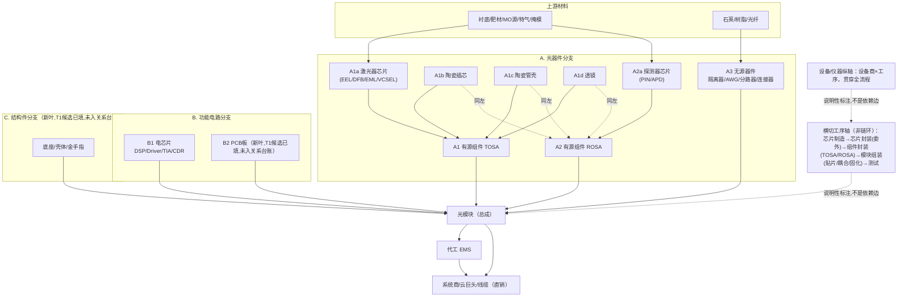

# 光模块供应链全景 v1.1 — 树 × 每节点公司名单（结构重排版）

> **本版性质**：本文件相对 `output/光模块供应链全景-v1.md`（保留不改）**只做结构重排**，
> 骨架据 Claude 终审定稿修复 v1 的线性化建模错误——v1 把"陶瓷插芯/陶瓷管壳/透镜"
> 与"隔离器/波分复用器/分路器/光纤连接器"混编为同一条"无源器件"链环，实际前者是
> 汇入 TOSA/ROSA 的并行支路（组件级子部件），后者是与 TOSA/ROSA 并列进入模块的
> 独立无源器件；v1 也把"芯片封装"处理成主链一环，实际它是横切全流程的工序，不是
> BOM 树上的一个节点层。**公司名单、锚、状态逐行照抄 v1，不增不删不改一字**；新增
> 的只有节点归属（放进哪一叶）与导航性文字，且每处归属改动均在下方"诚实边界"节
> 注明依据与核对结果。
>
> **分档准入**：每家公司标两档之一——①**有锚**（`output/nodes.csv`+`edges.csv`已收录，且在
> `flows/out/supply-chain-nodes-v0.md`或六路内容台账中能指认到具体产品/工序的 T1 引语，
> stance 标注发行人自述/同业描述/披露方产品列/竞品描述之一）；②**线索级待锚**（有名字但无
> 单源 T1 产品锚，或来自 `flows/out/pilot-s0a.md` 等尚未走判定闸的候选，不编造、不升格）。
> **双闸声明**：本文只回答"谁在哪个节点、做什么"，**不表达供货关系**——供货关系的唯一承重
> 台账是 `output/edges.csv`，本文"关系台账有边?"列仅如实标注该公司名是否已作为供方或需方
> 出现在 edges.csv 中，不代表该边证明了本节点所述的产品身份。
> **准入来源**：`flows/out/s0c-gap-grid.md`（12 叶子×覆盖×缺口）+ `flows/out/supply-chain-nodes-v0.md`
> （169 公司×做什么×锚）+ `output/nodes.csv`/`edges.csv`（台账基线 169 节点/236 边）+
> `flows/BOM-词表-v0.md` + `flows/out/pilot-s0a.md`（InP 衬底候选）+ 六路内容台账
> （`ledger-SJZ/CGHX/YJZ/C35/SJ24/TCG24.md`，产品构成/设备-工序能力类条目补充节点锚，
> 但 issuer_self 条目在此仅作"做什么"身份线索，不承重关系边，遵循与 supply-chain-nodes-v0
> 一致的准入纪律）。生成日：2026-07-24。

## 0. 骨架图（mermaid，并行汇聚结构；模板/结构参照，非证据）



**文字骨架（与上图对应，替换 v1 §0 的线性 ASCII 图；东吴证券 BOM 树模板声明位置不变，仍为零次证据）**：

```
光模块（总成）由三条并行分支汇聚：
A. 光器件分支
   A1 有源组件 TOSA ←汇聚{A1a 激光器芯片(EEL/DFB/EML/VCSEL) + A1b 陶瓷插芯 + A1c 陶瓷管壳 + A1d 透镜}
   A2 有源组件 ROSA ←汇聚{A2a 探测器芯片(PIN/APD) + A1b-d 同左}
   A3 无源器件：隔离器 / 波分复用器AWG / 分路器 / 光纤连接器(MPO/FAU)
B. 功能电路分支
   B1 电芯片(DSP/Driver/TIA/CDR)  B2 PCB板(新叶,T1候选已填,未入关系台账)
C. 结构件分支(底座/壳体/金手指)(新叶,T1候选已填,未入关系台账)
上游材料层分别喂给叶子：衬底/靶材/MO源/特气/掩模→A1a·A2a；石英/树脂/光纤→A3
横切工序轴(单独一节,非链环)：芯片制造→芯片封装(委外)→组件封装(TOSA/ROSA)→模块组装(贴片/耦合/固化)→测试
设备/仪器纵轴：设备商×工序 映射保留
下游：模块→(直销/经代工EMS)→系统商/云/线缆
```

---

## A. 光器件分支

### A1 有源组件 TOSA（汇聚 A1a + A1b + A1c + A1d）

#### A1a 激光器芯片（EEL/DFB/EML/VCSEL）

> 行来自 v1 §2「光芯片」表；仅搬入身份依据明确指向"激光器芯片"的两行。

| 名称 | 身份依据一句 | 锚 | 关系台账有边? |
|---|---|---|---|
| N33 源杰科技 | 光芯片的研发、设计、生产与销售（激光器芯片系列） | 有锚；发行人自述（招股书/年报主营句） | 有（E049→猎奇智能需方；E166/E168等多条→源杰为需方；E181起→源杰为供方） |
| N160 长光华芯 | 半导体激光芯片、器件及模块等激光行业核心元器件的研发、生产与销售 | 有锚；发行人自述（招股书/年报）；CGHX内容台账补充：光纤耦合模块工艺流程含快轴/慢轴准直透镜组装（自用于封装，非透镜生产者） | 有（E201起→需方多条；E217起→供方多条） |

（另见 A2a：武汉云岭光电 N119/N120 身份依据同时含"激光器和探测器芯片"，不拆分整行，正行放于 A2a。）

#### A1b 陶瓷插芯

> 行来自 v1 §5.2；本轮已由"同业描述"升格为发行人自述直接产品锚。

| 名称 | 身份依据一句 | 锚 | 关系台账有边? |
|---|---|---|---|
| N104 太辰光 | 光互联元件类别下的陶瓷插芯、MT插芯，用于保证光纤定位 | 有锚；发行人自述（2024年报产品应用表）："陶瓷插芯、MT 插芯｜保证光纤定位"（ledger-TCG24 TCG24-产品应用表段）——升级前仅有仕佳光子招股书竞品段"太辰光主营…陶瓷插芯、光纤连接器"的同业描述，本轮补齐发行人自身产品表直证 | 有（E165→Corning；E232→Corning(解匿)） |

#### A1c 陶瓷管壳（T1并入候选，未入关系台账）

> 候选来自 `flows/out/t1-leaf-fill.md`〈建议终验并入〉，节点层宽闸候选，检索日期2026-07-24，尚未建立供货关系边。

| 名称 | 身份依据引语 | 锚URL | 状态 |
|---|---|---|---|
| 三环集团 | "专为光芯片封装设计的高可靠性陶瓷管壳"及"陶瓷封装管壳等光通信产品已推向市场" | [2025年年度报告](https://static.cninfo.com.cn/finalpage/2026-03-28/1225041594.PDF) | 节点层宽闸,T1并入,未入关系台账 |
| 中瓷电子 | "公司电子陶瓷系列产品包括光通信器件外壳" | [2023年年度报告](https://static.cninfo.com.cn/finalpage/2024-04-26/1219832754.PDF) | 节点层宽闸,T1并入,未入关系台账 |

> 原 v1 §5.5 近邻候选（未入本叶）：N12 天孚通信（类型=光器件/组件厂，命中"陶瓷套管/陶瓷插芯"，
> 未命中"陶瓷管壳"字样，常识候选无锚弃，详见 t1-leaf-fill.md 候选弃用节）；N138 深圳市宏钢机械
> 设备有限公司（产品列"盖板、壳体组等"→长光华芯，为激光器件壳体，未必等同于光模块陶瓷管壳）。

#### A1d 透镜（仍为部分/弱覆盖，无专产主体）

> 行来自 v1 §5.3。

| 名称 | 身份依据一句 | 锚 | 关系台账有边? |
|---|---|---|---|
| N143 炬光（东莞）微光学有限公司 | 光学件 | 半锚；披露方产品列（长光华芯招股书外协采购表），未专锚"透镜/准直透镜"字样 | 有（E211→长光华芯） |
| N160 长光华芯 | 光纤耦合模块封装工艺含快轴/慢轴准直透镜组装、光纤组装、耦合组装等步骤 | 弱锚；CGHX内容台账工序步骤条目（发行人自述封装流程），显示长光华芯**使用**准直透镜完成自身激光器件封装，不构成透镜**生产者**身份 | 有（同 A1a 节，与上一条为同一节点不同身份依据行） |
| N145 腾景科技股份有限公司 | （类型）光器件 | 仅类型归层，待锚 | 有（E212→长光华芯，外协光学相关边） |
| 福晶科技 | 精密光学元件涵盖……球面透镜、柱面透镜、非球面透镜，应用包括光通信波分复用器 | 部分证实；披露方产品列（[2025年年度报告](https://static.cninfo.com.cn/finalpage/2026-04-29/1225227139.pdf)），不宣称其透镜专供光模块，T1并入候选来自`flows/out/t1-leaf-fill.md` | 节点层宽闸,T1并入,未入关系台账 |

### A2 有源组件 ROSA（汇聚 A2a + A1b-d 同左，不重复列表）

#### A2a 探测器芯片（PIN/APD）

> 从 v1 §2「光芯片」表单列。台账候选按 v1 原文身份依据核对如下：
> - **武汉云岭光电（N119/N120）**：v1 原文身份依据为"光通信用激光器和探测器芯片（含封装类产品）"，
>   锚为"有锚；同业描述（源杰招股书同业段）"——**身份依据明确覆盖探测器芯片，予以归入**（同时
>   也覆盖激光器芯片，见 A1a 处的交叉引用，不重复整行）。
> - **武汉昱升光电（N122）**：v1 原文身份依据为"芯片封装（委托加工）"（见 v1 §3），**不含**探测器
>   芯片产品字样，核对后**不归入**本叶，保留在下方"横切工序轴 §芯片封装"节。
> - **武汉灿光光电（N124）**：v1 原文身份依据为"（类型）光/电芯片，仅类型归层，待锚"，无具体
>   探测器芯片指向，核对后**不归入**本叶，按"归属有疑义保守放其余光器件"处理，见下方
>   "A-其余光器件"节。

| 名称 | 身份依据一句 | 锚 | 关系台账有边? |
|---|---|---|---|
| N119 武汉云岭光电有限公司 | 光通信用激光器和探测器芯片（含封装类产品） | 有锚；同业描述（源杰招股书同业段） | 有（E137/E141→华工科技） |
| N120 武汉云岭光电股份有限公司 | 光通信用激光器和探测器芯片（含封装类产品） | 有锚；同业描述（源杰招股书同业段） | 有（E138/E142→华工科技） |

### A3 无源器件：隔离器 / 波分复用器AWG / 分路器 / 光纤连接器（MPO/FAU）

> 太辰光"光纤连接器为主业"（含 MPO/FAU 品类）已内嵌于下表太辰光身份依据一句中，
> 从 v1 §5.1 原样带入，不另立新行。仕佳光子身份依据一句同时覆盖 AWG + PLC分路器
> + 光纤连接器三类，一并列于此叶，不拆分重复。

#### 波分复用器 / AWG（本轮升级：仕佳光子已由"宽类型"升格为具体产品锚）

| 名称 | 身份依据一句 | 锚 | 关系台账有边? |
|---|---|---|---|
| N85 仕佳光子 | 光芯片及器件（PLC分路器芯片系列、**AWG芯片系列产品**、DFB激光器芯片系列、光纤连接器）、室内光缆、线缆材料的研发、生产及销售 | 有锚；发行人自述，产品构成条目升级：招股书"仕佳光子主要产品包括光芯片及器件…AWG芯片系列产品…"（ledger-SJZ SJZ284/286）+ 2024年报"应用于400G和800G光模块的CWDM/LAN WDM AWG组件已实现大批量出货""60通道100GHz AWG…芯片及模块已在骨干及城域网…相干通信应用中实现批量出货"（ledger-SJ24 SJ24-32起）；供货边 E110 已确认对 Intel 的数据中心 AWG 器件批量销售（招股书原文，此边证据独立于本节点锚，双闸不混用） | 有（E110→Intel；E100/E101/E102等→需方） |
| N104 太辰光 | 陶瓷插芯/光纤连接器为主业（AWG为在研项目，尚未量产） | 有锚（在研阶段）；发行人自述："AWG 芯片开发｜持续进行中｜产品实现批量产销"（ledger-TCG24 TCG24研发投入表，2024年报）——**注意**：这是在研项目，不构成"生产中"锚，仅作为该公司技术布局线索登记 | 有（E165→Corning；E232→Corning(解匿)） |

> 注：仕佳光子上一行的身份依据一句已包含"PLC分路器芯片系列"与"光纤连接器"，
> 视为对本叶"分路器"与"光纤连接器"两品类的同一行覆盖，不重复列行。

#### 隔离器（T1并入候选，未入关系台账）

> 候选来自 `flows/out/t1-leaf-fill.md`〈建议终验并入〉，节点层宽闸候选，检索日期2026-07-24，尚未建立供货关系边。

| 名称 | 身份依据引语 | 锚URL | 状态 |
|---|---|---|---|
| 光库科技 | "光通讯器件……主要产品包括隔离器" | [2023年年度报告](https://static.cninfo.com.cn/finalpage/2024-04-03/1219506244.PDF) | 节点层宽闸,T1并入,未入关系台账 |
| 天孚通信 | "光无源器件包括……光隔离器等" | [2020年向特定对象发行股票募集说明书](https://static.cninfo.com.cn/finalpage/2020-08-03/1208119960.PDF) | 节点层宽闸,T1并入,未入关系台账 |

> 原 v1 §5.4 弱覆盖背景保留：BOM词表v0"隔离器"一词出处为猎奇招股书原材料构成（非具名
> 供应商）；仕佳招股书竞品段提及"光隔离器"品类未落为台账对手方节点；源杰招股书仅将光
> 隔离器定义为行业无源组件品类（"光无源组件…主要包括光隔离器、光分路器、光开关、光连接器、
> 光背板等"，ledger-YJZ YJZ440-442，industry stance，非具名生产商）；博创科技命中"光隔离器"
> 字样但仅见消费类AOC研发新品列举，未进入主营产品表，常识候选无锚弃，未入本叶。

### A-其余光器件（未细分至 A1/A2/A3 具体叶，仅类型归层）

> 合并 v1 §5.6 原 18 家 + 从 v1 §2「光芯片」表中"归属有疑义"迁入的 6 家（士兰微、三安光电、
> Intel、成都储翰科技、成都智禾光通、武汉灿光光电——均只有"仅类型归层，待锚"的通用
> 光/电芯片或半导体身份依据，无法坐实到 A1a 激光器芯片或 A2a 探测器芯片任一具体叶，
> 保守放本桶，不硬归），共 24 家。

| 名称 | 身份依据一句 | 锚 | 关系台账有边? |
|---|---|---|---|
| N04 Lumentum | （类型）光器件厂 | 仅类型归层，待锚 | 有（E005起多条） |
| N07 NeoPhotonics | （类型）光器件厂(已消亡) | 仅类型归层，待锚 | 有（E008/E009） |
| N12 天孚通信 | （类型）光器件/组件厂 | 仅类型归层，待锚 | 有（E043/E065/E066→Fabrinet） |
| N18 Coherent | 光器件/模块厂（类型跨层，本表暂归器件层） | 仅类型归层，待锚 | 有（E039-E042） |
| N46 士兰微 | （类型）半导体IDM | 仅类型归层，待锚 | 有（E086→联讯仪器需方） |
| N48 三安光电 | （类型）化合物半导体/光芯片 | 仅类型归层，待锚 | 有（E091/E095→联讯仪器需方） |
| N58 Intel(含其代工厂) | （类型）光/电芯片 | 仅类型归层，待锚 | 有（E110→仕佳光子需方） |
| N70 上海宽捷光电科技有限公司 | （类型）光器件 | 仅类型归层，待锚 | 有（E203→长光华芯） |
| N76 东莞福可喜玛通讯科技有限公司 | （类型）光器件 | 仅类型归层，待锚 | 有（E103/E115→仕佳光子） |
| N95 博创科技 | 光通信领域集成光电子器件的研发、生产和销售 | 有锚；发行人自述（2024年报） | 有（E145起多条） |
| N96 博创科技股份有限公司 | 光通信领域集成光电子器件的研发、生产和销售 | 有锚；发行人自述（2024年报） | 有（E186→源杰科技需方） |
| N98 四川乐飞光电科技有限公司 | （类型）光器件 | 仅类型归层，待锚 | 有（E156→博创科技） |
| N100 四川光恒通信技术有限公司 | （类型）光器件 | 仅类型归层，待锚 | 有（E151/E157→博创科技） |
| N101 四川飞普科技有限公司 | （类型）光器件 | 仅类型归层，待锚 | 有（E152/E158→博创科技） |
| N105 常州太平通讯科技有限公司 | （类型）光器件 | 仅类型归层，待锚 | 有（E120→仕佳光子） |
| N109 成都储翰科技 | （类型）光/电芯片 | 仅类型归层，待锚；entity-evidence-q3 确认仍在旭创系（2025-10旭光电子转让32.55%股权予中际旭创） | 有（E188→源杰科技需方） |
| N111 成都智禾光通(原成都旭创科技) | （类型）光/电芯片 | 仅类型归层，待锚；entity-evidence-q3：2023年报"成都旭创"本期数与2024年报"智禾"上期数逐位一致，推断同主体更名/承继（B级） | 有（E189→源杰科技需方） |
| N114 普利技术潜江有限公司 | （类型）光器件 | 仅类型归层，待锚 | 有（E160→博创科技） |
| N123 武汉正源高理光学有限公司 | （类型）光器件 | 仅类型归层，待锚 | 有（E139/E143→华工科技） |
| N124 武汉灿光光电有限公司 | （类型）光/电芯片 | 仅类型归层，待锚 | 有（E123/E133→仕佳光子） |
| N130 波若威光纤通讯有限公司 | （类型）光器件 | 仅类型归层，待锚 | 有（E125→仕佳光子） |
| N142 湖北瑞创信达光电有限公司 | （类型）光器件 | 仅类型归层，待锚 | 有（E140/E144→华工科技） |
| N151 苏州环明电子科技有限公司 | （类型）光器件 | 仅类型归层，待锚 | 有（E213→长光华芯） |
| N154 苏州镓锐芯光科技有限公司 | （类型）光/电芯片 | 仅类型归层，待锚 | 有（E215/E228→长光华芯） |
| N157 郑州仕佳通信科技有限公司 | 光芯片及器件、室内光缆、线缆材料研发生产销售（仕佳体系主体） | 有锚（弱）；发行人自述母名主营外延至同名体系 | 有（E127→仕佳光子） |

---

## B. 功能电路分支

### B1 电芯片（DSP / 激光驱动 Driver / 限幅放大 TIA / 时钟恢复 CDR）

> 行与honesty段落原样来自 v1 §4，位置不变，仅分支编号从 L3 改记为 B1。

| 名称 | 身份依据一句 | 锚 | 关系台账有边? |
|---|---|---|---|
| N05 Acacia | （类型）相干光器件/DSP | 仅类型归层，待锚 | 有（E006→Fabrinet需方） |
| N15 博通(Broadcom) | PHY/光组件："AI semiconductor solutions include…physical layer devices (PHYs) and optical components"；"We supply a wide array of optical components" | FY2025 10-K产品段(sec.gov avgo-20251102.htm,共识结构层补锚2026-07-24) | 有（E011/E094→需方；E235/E236→供方匿名槽位） |
| N62 Marvell | DSP+Driver+TIA全覆盖："interconnect products include PAM, coherent and coherent-lite DSPs, laser drivers, TIAs, silicon photonics, CPO, LPO chipsets" | FY2026 10-K产品段(sec.gov mrvl-20260131.htm,补锚2026-07-24) | 有（E233/E234→供方匿名槽位） |
| N73 上海橙科微电子科技有限公司 | （类型）光/电芯片；**常识候选:光通信DSP/CDR厂商,待披露锚核实** | 仅类型归层，待锚 | 有（E182→源杰科技需方） |

**子槽状态更新(2026-07-24补锚)**：DSP/Driver/TIA 三子槽由 Marvell 10-K 产品段一句锚齐(海外主体)；Broadcom PHY/光组件锚齐；**国产主体仍全空**——这是叶内真正的结构事实。原诚实缺口记录保留如下：
上表 4 家均"仅类型归层，待锚"，无一家有具名产品锚指向 Driver/TIA/CDR/DSP。仕佳光子招股书
"硅光系列（相干光收发芯片、高速调制器、光开关等芯片；TIA、LDDriver、CDR 芯片）"一句
（ledger-SJZ SJZ35）经核实为**行业产品分类表**，条目本身明确"仕佳光子未披露硅光系列自有
产品"，不得作为仕佳光子生产 TIA/Driver/CDR 的身份锚。**未识别到公开可锚的专产主体**。
定向任务：①模块厂/设备商供应商表产品列筛"Driver/TIA/CDR"具名发行人；②Broadcom/Marvell
10-K 产品段补节点层"做什么"锚（禁止把客户集中度半边槽位误读为产品锚，参见 E233/E234/E235/E236
备注"非DSP专属槽位"）。

### B2 PCB板（T1并入候选，未入关系台账）

> 候选来自 `flows/out/t1-leaf-fill.md`〈建议终验并入〉，节点层宽闸候选，检索日期2026-07-24，尚未建立供货关系边。
> v1 全篇未收录任何以 PCB 板为具名产品锚的公司节点，`flows/out/s0c-gap-grid.md` 12 叶盘格与
> `flows/BOM-词表-v0.md` 均未覆盖此叶；本叶为本轮 T1 首次填补。

| 名称 | 身份依据引语 | 锚URL | 状态 |
|---|---|---|---|
| 景旺电子 | "800G光模块等高速PCB产品已实现量产" | [2024年年度报告](https://static.cninfo.com.cn/finalpage/2025-04-29/1223377812.PDF) | 节点层宽闸,T1并入,未入关系台账 |
| 四会富仕 | "应用于光通信的800G光模块PCB等新型产品" | [2024年年度报告](https://static.cninfo.com.cn/finalpage/2025-03-29/1222948563.PDF) | 节点层宽闸,T1并入,未入关系台账 |
| 本川智能 | "高频高速产品已在光模块客户中实现小批量出货" | [2025年年度报告](https://static.cninfo.com.cn/finalpage/2026-04-29/1225228204.PDF) | 节点层宽闸,T1并入,未入关系台账,小批量,成熟度低 |

---

## C. 结构件分支（底座/壳体/金手指）（T1并入候选，未入关系台账）

> 候选来自 `flows/out/t1-leaf-fill.md`〈建议终验并入〉，节点层宽闸候选，检索日期2026-07-24，尚未建立供货关系边。
> 注意本叶与 A1c「陶瓷管壳」不同层级——A1c 指向 TOSA/ROSA 组件级的陶瓷管壳，本叶指向
> 模块级结构件（模块外壳底座、金手指连接器等）。近邻信息：A1c 节 N138 深圳市宏钢机械
> 设备有限公司（产品列"盖板、壳体组等"→长光华芯）为激光器件壳体，层级同样偏组件级，
> 不构成模块结构件专产锚，不重复搬入本叶。

| 名称 | 身份依据引语 | 锚URL | 状态 |
|---|---|---|---|
| 斯瑞新材 | "光模块芯片基座/壳体"为主要产品；"目前已实现壳体批量供应" | [2025年年度报告](https://static.cninfo.com.cn/finalpage/2026-04-28/1225214766.PDF) | 节点层宽闸,T1并入,未入关系台账 |

---

## 光模块（总成）— 三分支汇聚节点（L6，27 家）

> 行来自 v1 §7，原样搬入，位置不变——本节即骨架图中 A/B/C 三分支汇聚而成的"光模块（总成）"节点。

| 名称 | 身份依据一句 | 锚 | 关系台账有边? |
|---|---|---|---|
| N10 中际旭创 | （类型）光模块厂 | 仅类型归层，待锚 | 有（E044起多条，供方/需方均有） |
| N11 新易盛 | （类型）光模块厂 | 仅类型归层，待锚 | 有（E015起多条） |
| N19 Applied Optoelectronics(AAOI) | （类型）光模块厂 | 仅类型归层，待锚 | 有（E017起多条；边中作"AAOI"） |
| N31 索尔思(Source Photonics) | （类型）光模块厂 | 仅类型归层，待锚 | 有（E047→猎奇智能需方） |
| N32 光迅科技 | 光收发模块、有源光缆、光放大器、波长管理器件、光通信器件、子系统等 | 有锚；发行人自述（2023年报） | 有（E048/E074/E075起） |
| N47 海信集团 | （类型）光模块/宽带(海信宽带) | 仅类型归层，待锚；entity-evidence-q3：海信宽带确认为海信集团全资子公司（2003年海信集团控股+TransLight共设），置信中 | 有（E087/E089/E092→联讯仪器需方） |
| N49 ALFAFONET ENDUSTRIYEL TELEKOM URUNLERI A.S. | （类型）模块/光电子商 | 仅类型归层，待锚 | 有（E106→仕佳光子） |
| N51 Cloud Light Technology Limited | （类型）模块/光电子商 | 仅类型归层，待锚 | 有（E148→博创科技） |
| N54 FOSTEC | （类型）模块/光电子商 | 仅类型归层，待锚 | 有（E107→仕佳光子） |
| N55 Fibracem Teleinformática Ltda. | （类型）模块/光电子商 | 仅类型归层，待锚 | 有（E108→仕佳光子） |
| N59 KUMPULAN ABEX SDN BHD | （类型）模块/光电子商 | 仅类型归层，待锚 | 有（E111→仕佳光子） |
| N60 Kaiam Corporation | （类型）模块/光电子商 | 仅类型归层，待锚 | 有（E146→博创科技，坏账核销/关系已死亡） |
| N65 Out Line S.r.l. | （类型）模块/光电子商 | 仅类型归层，待锚 | 有（E112→仕佳光子） |
| N66 PRIME WORLD INTERNATIONAL HOLDINGS LTD. | （类型）模块/光电子商 | 仅类型归层，待锚 | 有（E113→仕佳光子） |
| N67 SHARPNFLAT INC | （类型）模块/光电子商 | 仅类型归层，待锚 | 有（E114→仕佳光子） |
| N68 上海八界光电科技有限公司 | （类型）模块/光电子商 | 仅类型归层，待锚 | 有（E181→源杰科技需方） |
| N77 东莞铭普光磁股份有限公司 | （类型）模块/光电子商 | 仅类型归层，待锚 | 有（E183→源杰科技需方） |
| N87 全科科技有限公司 | （类型）模块/光电子商 | 仅类型归层，待锚 | 有（E185→源杰科技需方） |
| N99 四川九州光电子技术有限公司 | （类型）模块/光电子商 | 仅类型归层，待锚 | 有（E187→源杰科技需方） |
| N107 德国罗森博格通讯有限公司 | （类型）模块/光电子商 | 仅类型归层，待锚 | 有（E121→仕佳光子） |
| N112 成都蓉博通信技术有限公司 | （类型）模块/光电子商 | 仅类型归层，待锚 | 有（E190→源杰科技需方） |
| N113 成都迪谱光电科技有限公司 | （类型）模块/光电子商 | 仅类型归层，待锚 | 有（E191→源杰科技需方） |
| N127 汇聚科技（惠州）有限公司 | （类型）模块/光电子商 | 仅类型归层，待锚 | 有（E124→仕佳光子） |
| N136 深圳市亚美斯通电子有限公司 | （类型）模块/光电子商 | 仅类型归层，待锚 | 有（E192→源杰科技需方） |
| N148 苏州旭创科技有限公司 | （类型）模块/光电子商 | 仅类型归层，待锚 | 有（E193→源杰科技需方） |
| N165 青岛海信宽带多媒体技术有限公司 | （类型）模块/光电子商 | 仅类型归层，待锚 | 有（E194→源杰科技需方） |
| N169 香港新南利 | （类型）模块/光电子商 | 仅类型归层，待锚 | 有（E129→仕佳光子） |

---

## 上游材料（分喂 A 分支各叶）

### 材料 → A1a·A2a（芯片衬底/靶材/MO源/特气/光刻掩模类，13 家）

> 从 v1 §1（25家）中按身份依据一句的材料类型拆出：衬底、靶材、MO源（金属有机物）、
> 特气、光刻/显影相关材料、光刻掩模板，均服务于芯片制造工序（喂给 A1a 激光器芯片、
> A2a 探测器芯片两叶）。

| 名称 | 身份依据一句 | 锚 | 关系台账有边? |
|---|---|---|---|
| N61 Maruwa Co.,Ltd | 热沉 | 有锚；披露方产品列（长光华芯招股书供应商表） | 有（E201→长光华芯） |
| N69 上海函泰电子科技有限公司 | 显影液、增粘剂、光刻胶等 | 有锚；披露方产品列（源杰招股书供应商表） | 有（E166→源杰科技） |
| N84 京瓷（中国）商贸有限公司 | 热沉 | 有锚；披露方产品列（长光华芯招股书供应商表） | 有（E204→长光华芯） |
| N93 北京通美晶体 | 衬底（InP等晶圆衬底） | 有锚；披露方产品列（源杰/长光华芯招股书供应商表）；另 pilot-s0a 确认其现行 InP substrate 供货（AXT 2026-06-17 Form 8-K） | 有（E168→源杰科技；E205→长光华芯） |
| N103 大阳日酸特殊气体（上海）有限公司 | 磷化氢、砷化氢 | 有锚；披露方产品列（源杰招股书供应商表） | 有（E170→源杰科技） |
| N115 有研亿金新材料有限公司 | 金靶、铂靶、金锗靶等/贵金属蒸发材料 | 有锚；披露方产品列（源杰/长光华芯招股书供应商表） | 有（E172→源杰科技；E206→长光华芯） |
| N128 江苏南大光电材料股份有限公司 | 磷烷、三甲基铟、三甲基镓等 | 有锚；披露方产品列（源杰招股书供应商表）；pilot-s0a 三甲基铟检索确认其为核心生产主体 | 有（E175→源杰科技） |
| N129 泛孟新材料（上海）有限公司 | 异丙醇、光刻胶去除液 | 有锚；披露方产品列（源杰招股书供应商表） | 有（E176→源杰科技） |
| N131 泰库尼思科电子（苏州）有限公司 | 热沉 | 有锚；披露方产品列（长光华芯招股书供应商表） | 有（E207→长光华芯） |
| N140 深圳市路维光电股份有限公司 | 光刻掩模板 | 有锚；披露方产品列（源杰招股书供应商表） | 有（E179→源杰科技） |
| N155 西安卫光气体有限公司 | 氮气、氢气、氧气、氩气等 | 有锚；披露方产品列（源杰招股书供应商表） | 有（E196→源杰科技） |
| N156 诺力昂化学品（宁波）有限公司 | 金属有机物（MO源类） | 有锚；披露方产品列（源杰招股书供应商表） | 有（E197→源杰科技） |
| N163 陕西兴化集团有限责任公司 | 氢气、氮气 | 有锚；披露方产品列（源杰招股书供应商表） | 有（E198→源杰科技） |

#### InP 衬底线索级候选（未入 nodes.csv/edges.csv，来自 `flows/out/pilot-s0a.md` S0a 试点，仅供后续判定闸参考）

> 从 v1 §1.1 原样搬入，同样喂给 A1a·A2a 叶。

| 名称 | 身份依据一句 | 锚 | 关系台账有边? |
|---|---|---|---|
| 珠海鼎泰芯源晶体有限公司 | InP衬底单晶材料的研发、生产及销售 | 线索级待锚；历史交叉锚（cninfo 2021-06-26），当期 Wind 未返回，需 owner 核对量产连续性 | 否，候选未入台账 |
| 青岛立昂晶电半导体科技有限公司 | 掌握2/3英寸磷化铟衬底生产技术，已实现小批量交付 | 线索级待锚；框架协议锚（cninfo 2026-06-22），小批量交付发生在资产转让前，连续性待终裁 | 否，候选未入台账 |
| 江苏兴光半导体有限公司 | 收购磷化铟衬底制造与销售业务（拟生产） | 线索级待锚；同上框架锚，收购后需备案/环评/安评方可生产 | 否，候选未入台账 |
| 云南鑫耀半导体材料有限公司（云南锗业体系） | 2025年生产磷化铟晶片10.01万片 | 线索级待锚；云南锗业2026-05-11投资者关系记录，上市披露主体与实际生产主体需分层建实体 | 否，候选未入台账 |
| 江苏光铟半导体有限公司（拟设） | 从事磷化铟衬底的研发生产销售（拟设项目） | 线索级待锚；上交所监管交叉锚，合作方被监管指出无实际业务，高风险待闸 | 否，候选未入台账 |

### 材料 → A3（石英/树脂/光纤等无源器件材料，6 家）

| 名称 | 身份依据一句 | 锚 | 关系台账有边? |
|---|---|---|---|
| N64 OharaQuartzCo.,Ltd. | 石英片 | 有锚；披露方产品列（仕佳光子招股书供应商表） | 有（E100→仕佳光子） |
| N71 上海普恩化工有限公司 | EVA树脂 | 有锚；披露方产品列（仕佳光子招股书供应商表） | 有（E101→仕佳光子） |
| N72 上海景仓通信技术有限公司 | 光纤 | 有锚；披露方产品列（仕佳光子招股书供应商表） | 有（E102→仕佳光子） |
| N108 成都中住光纤有限公司 | 光纤 | 有锚；披露方产品列（仕佳光子招股书供应商表） | 有（E130→仕佳光子） |
| N116 杜邦(含关联方) | 芳纶纱 | 有锚；披露方产品列（仕佳光子招股书供应商表） | 有（E131→仕佳光子） |
| N133 洛阳中超新材料股份有限公司 | 氢氧化铝 | 有锚；披露方产品列（仕佳光子招股书供应商表） | 有（E134→仕佳光子） |

### 材料对象未细分（仅类型归层，待锚，无法判定具体喂入叶子，6 家）

> 身份依据一句仅为"（类型）材料/设备供应商"等宽类型描述，无法判定具体喂给
> A1a·A2a 还是 A3，保守不细分，原样列出。

| 名称 | 身份依据一句 | 锚 | 关系台账有边? |
|---|---|---|---|
| N35 奥普瑞 | （类型）加工件供应商 | 仅类型归层，待锚 | 有（E052→猎奇智能） |
| N132 泰科电子(含关联方) | （类型）材料/设备供应商 | 仅类型归层，待锚 | 有（E126→仕佳光子） |
| N135 深圳市中迅实业有限公司 | （类型）材料/设备供应商 | 仅类型归层，待锚 | 有（E208→长光华芯） |
| N138 深圳市宏钢机械设备有限公司 | 盖板、壳体组等 | 有锚；披露方产品列（长光华芯招股书供应商表）；邻域可能涉及激光器件壳体，未证光模块陶瓷管壳身份 | 有（E209→长光华芯） |
| N139 深圳市星欣磊实业有限公司 | （类型）材料/设备供应商 | 仅类型归层，待锚 | 有（E210→长光华芯） |
| N153 苏州邦皓电子新材料有限公司 | （类型）上游材料 | 仅类型归层，待锚 | 有（E214→长光华芯） |

---

## 横切工序轴（单独一节，非链环）

> 芯片制造→芯片封装（委外）→组件封装（TOSA/ROSA）→模块组装（贴片/耦合/固化）→测试。
> 本轴与上面的 A/B/C 分支树是**两个不同的坐标轴**：分支树回答"谁做什么零件"，本轴回答
> "同一批零件按什么工序顺序被加工"，两者不应合并成一条线性链（这正是 v1 的线性化错误
> 之一）。芯片制造环节即 A1a/A2a 两叶本身（不重复列表）；模块组装环节的产出即上面
> "光模块（总成）"节点（不重复列表）；测试环节所用设备见下方"设备/仪器纵轴"节
> （不重复列表）。本节只列有独立公司名单的"芯片封装（委托加工）"与"组件封装
> （TOSA/ROSA）"两个工序阶段。

### 芯片封装（委托加工，跨光/电芯片工序，9 家）

> 行来自 v1 §3，原样搬入，位置由"主链一环"改记为"工序轴一段"。

> 本层为源杰科技招股书披露的委托加工业务，9 家均为"芯片封装（委托加工）"产品列锚，
> 属光芯片→器件之间的工序外包环节，不单独归入光芯片或电芯片。

| 名称 | 身份依据一句 | 锚 | 关系台账有边? |
|---|---|---|---|
| N92 北京康特睿科光电科技有限公司 | 芯片封装（委托加工） | 有锚；披露方产品列（源杰招股书委托加工表） | 有（E167→源杰科技） |
| N106 广东瑞谷光网通信股份有限公司 | 芯片封装（委托加工） | 有锚；披露方产品列（源杰招股书委托加工表） | 有（E171→源杰科技） |
| N118 桂林芯飞光电子科技有限公司 | 芯片封装（委托加工） | 有锚；披露方产品列（源杰招股书委托加工表） | 有（E173→源杰科技） |
| N122 武汉昱升光电(原昱升光器件) | 芯片封装（委托加工） | 有锚；披露方产品列（源杰招股书委托加工表）；entity-evidence-q3：工商统一社会信用代码一致，确认同一法人更名（置信中高） | 有（E174→源杰科技；E122/E132→仕佳光子；E161→博创科技） |
| N134 深圳市东飞凌科技有限公司 | 芯片封装（委托加工） | 有锚；披露方产品列（源杰招股书委托加工表） | 有（E177→源杰科技） |
| N137 深圳市力子光电科技有限公司 | 芯片封装（委托加工） | 有锚；披露方产品列（源杰招股书委托加工表） | 有（E178→源杰科技） |
| N141 湖北安一辰光电科技有限公司 | 芯片封装（委托加工） | 有锚；披露方产品列（源杰招股书委托加工表） | 有（E180→源杰科技） |
| N146 芯思杰技术（深圳）股份有限公司 | 芯片封装（委托加工） | 有锚；披露方产品列（源杰招股书委托加工表） | 有（E195→源杰科技） |
| N44 Power Master | （类型）功率器件封测(半导体) | 仅类型归层，待锚 | 有（E082→联讯仪器需方） |

### 组件封装（TOSA/ROSA，仍未识别到专产主体；天孚通信构成工序覆盖线索）

> 段落来自 v1 §6，原样搬入。**注意**：本段说的是"把芯片+陶瓷插芯/管壳+透镜组装成
> TOSA/ROSA 成品"这道工序本身的执行者，与上面 A1a/A1b/A1c/A1d/A2a 各叶"提供零件"
> 的公司是两回事——v1 曾把二者混在同一个"有源组件"层里，本版结构重排后二者分离：
> 零件供应商归 A 分支各叶，工序执行者归本处横切轴。

| 名称 | 身份依据引语 | 锚URL | 状态 |
|---|---|---|---|
| 天孚通信 | "OSA光器件（TOSA/ROSA/BOSA）" | [2020年向特定对象发行股票募集说明书](https://static.cninfo.com.cn/finalpage/2020-08-03/1208119960.PDF) | 组件封装工序覆盖,非专产判定 |

> 天孚通信该锚来自 `flows/out/t1-leaf-fill.md`〈用户点名的相邻叶/横切工序〉节，检索日期
> 2026-07-24：OSA 由光接口与激光器耦合焊接形成，属于组件封装工序覆盖，不构成"专产
> TOSA/ROSA 主体"判定，本轴仍如实标注未识别到公开可锚的专产主体。

**未识别到公开可锚的专产主体。** 源杰科技招股书对产业链的自述给出了 TOSA/ROSA 的定义性
描述："光芯片加工封装为光发射组件（TOSA）及光接收组件（ROSA），再将光收发组件、电芯片、
结构件等进一步加工成光模块"（ledger-YJZ YJZ180-184）——但这句话描述的是**行业通用工序**，
不是源杰自身生产 TOSA/ROSA 的身份主张（源杰是上游光芯片供应商，TOSA/ROSA 封装是其下游
客户环节）。s0c-gap-grid 排查过的宽类型候选（N04 Lumentum / N07 NeoPhotonics / N12 天孚 /
N18 Coherent / N85 仕佳光子 / N95·N96 博创科技等"光器件厂"归层）均无一家在节点层"做什么"
字段点名 TOSA/ROSA 产品；天孚通信虽有 OSA 组件锚，但 OSA 是组件封装工序覆盖而非专产
TOSA/ROSA 主体判定，不改变此结论。**定向任务**：①光迅/博创最新年报或招股书业务章节全文搜
"TOSA/光发射组件"；②模块厂（旭创/新易盛）供应商表产品列=TOSA 命中则补节点层专锚。

---

## 设备 / 仪器纵轴（贯穿封装-器件-模块-测试，不插入主链序，V，29 家）

> 行来自 v1 §8，原样搬入，未做任何改动——这是骨架图中"设备/仪器纵轴：设备商×工序
> 映射保留"的落地：纵轴含义是这些公司横跨多个工序阶段供应设备/仪器，本身不是 BOM
> 树上的某个零件供应商，因此不并入 A/B/C 任何分支，独立成节保留原顺序。

| 名称 | 身份依据一句 | 锚 | 关系台账有边? |
|---|---|---|---|
| N03 Cisco | （类型）网络设备OEM | 仅类型归层，待锚 | 有（E003/E004→Fabrinet需方） |
| N06 Infinera | （类型）系统设备商 | 仅类型归层，待锚 | 有（E007→Fabrinet需方） |
| N08 华为(含海思) | （类型）系统设备商 | 仅类型归层，待锚 | 有（E008"华为+海思"→NeoPhotonics；E033"华为"→Lumentum） |
| N09 Ciena | （类型）系统设备商 | 仅类型归层，待锚 | 有（E009/E029起→Lumentum需方） |
| N13 猎奇智能 | 光通信/半导体/汽车自动化等领域智能生产装备；产品应用于贴片、光学耦合、老化测试三核心环节 | 有锚；发行人自述（招股书第五节） | 有（E010/E045起多条） |
| N14 罗博特科/ficonTEC | 高精度光学组件和光电元件生产设备；半导体自动化微组装及精密测试设备设计研发生产销售 | 有锚；竞品描述（发行人披露）；BOM词表 E011/E012 标注CPO耦合设备；C35内容台账补充：正基于硅光/CPO光模块技术需求研发激光辅助键合、倒装热压等先进封装工艺（发行人自述，设备-工序能力条目） | 有（E011/E012→博通/NVIDIA；E076→客户匿名） |
| N16 凯格精机 | （类型）组装设备商 | 仅类型归层，待锚 | 有（E014→Fabrinet疑似客户；E077→客户匿名） |
| N22 ATX Networks | （类型）CATV设备商 | 仅类型归层，待锚 | 有（E021/E022→AAOI需方） |
| N25 Nokia | （类型）系统设备商 | 仅类型归层，待锚 | 有（E034→Lumentum需方） |
| N34 星微科技 | （类型）驱动控制供应商 | 仅类型归层，待锚；**注意**：为猎奇智能"驱动控制"类设备供应商，非光模块电芯片Driver IC，s0c-gap-grid已显式排除为假友元 | 有（E051→猎奇智能需方） |
| N38 烽火通信 | 信息通信网络产品与解决方案提供商，主营业务立足于光通信 | 有锚；发行人自述（2023年报） | 有（E074→光迅科技需方） |
| N39 奥特维 | （类型）组件封装设备商 | 仅类型归层，待锚；主业光伏，光模块设备为扩张线 | 有（E080→客户匿名） |
| N40 博众精工 | （类型）自动化设备商 | 仅类型归层，待锚；3C自动化主业 | 有（E081→客户匿名） |
| N41 快克智能 | （类型）焊接设备商 | 仅类型归层，待锚 | 有（E078→客户匿名） |
| N42 普源精电 | （类型）测试测量仪器 | 仅类型归层，待锚 | 有（E079→客户匿名） |
| N43 联讯仪器 | 电子测量仪器和半导体测试设备的研发、制造、销售及服务 | 有锚；发行人自述（招股书） | 有（E082起多条） |
| N75 上海飞博激光科技股份有限公司 | （类型）激光设备/科研 | 仅类型归层，待锚 | 有（E217→长光华芯需方） |
| N86 光惠激光科技有限公司 | （类型）激光设备/科研 | 仅类型归层，待锚 | 有（E219→长光华芯需方） |
| N89 创鑫激光 | （类型）激光设备/科研 | 仅类型归层，待锚 | 有（E220→长光华芯需方） |
| N102 大科激光 | （类型）激光设备/科研 | 仅类型归层，待锚 | 有（E221→长光华芯需方） |
| N121 武汉华日精密激光 | （类型）激光设备/科研 | 仅类型归层，待锚 | 有（E222→长光华芯需方） |
| N126 武汉高跃科技有限责任公司 | （类型）激光设备/科研 | 仅类型归层，待锚 | 有（E223→长光华芯需方） |
| N147 苏州单峰光子科技有限责任公司 | （类型）激光设备/科研 | 仅类型归层，待锚 | 有（E224→长光华芯需方） |
| N149 苏州星钥光子科技有限公司 | （类型）激光设备/科研 | 仅类型归层，待锚 | 有（E225→长光华芯需方） |
| N150 苏州焜原光电有限公司 | （类型）激光设备/科研 | 仅类型归层，待锚 | 有（E226→长光华芯需方） |
| N152 苏州睿科晶创光电科技有限公司 | （类型）激光设备/科研 | 仅类型归层，待锚 | 有（E227→长光华芯需方） |
| N159 锐科激光 | （类型）激光设备/科研 | 仅类型归层，待锚 | 有（E216/E229→长光华芯） |
| N167 飞博激光 | （类型）激光设备/科研 | 仅类型归层，待锚 | 有（E230→长光华芯需方） |
| N168 飞顿国际有限公司、飞顿国际科技有限公司 | （类型）激光设备/科研 | 仅类型归层，待锚 | 有（E231→长光华芯需方） |

---

## 下游

> 行来自 v1 §9，原样搬入。骨架图中"下游：模块→(直销/经代工EMS)→系统商/云/线缆"对应
> 下述两个子节：光模块（总成）→代工 EMS（9.1）→系统商/云/线缆终端（9.2），或光模块
> （总成）直销→9.2。

### 代工 EMS（L7，1 家）

| 名称 | 身份依据一句 | 锚 | 关系台账有边? |
|---|---|---|---|
| N01 Fabrinet | 向OEM提供光通信组件/模块/子系统等复杂产品的光学封装与精密光机电电子制造服务 | 有锚；发行人自述（Fabrinet 10-K） | 有（E001起多条，链条天孚→Fabrinet→NVIDIA两跳全实名） |

### 系统设备商 / 云巨头终端 / 线缆（L8，20 家）

| 名称 | 身份依据一句 | 锚 | 关系台账有边? |
|---|---|---|---|
| N02 NVIDIA | （类型）算力终端/系统商 | 仅类型归层，待锚 | 有（E001/E012→需方） |
| N20 Microsoft | （类型）云巨头(终端) | 仅类型归层，待锚 | 有（E017/E018/E019→AAOI需方） |
| N21 Oracle | （类型）云巨头(终端) | 仅类型归层，待锚 | 有（E020→AAOI需方） |
| N24 Apple | （类型）消费电子终端 | 仅类型归层，待锚；3D传感需求非光通信 | 有（E026/E027/E028→Lumentum需方） |
| N26 Google | （类型）云巨头(终端) | 仅类型归层，待锚 | 有（E035/E037→Lumentum需方） |
| N52 Corning Incorporated | （类型）线缆/系统/终端 | 仅类型归层，待锚 | 有（E165→太辰光需方） |
| N53 Corning(解匿) | （类型）线缆/系统/终端 | 仅类型归层，待锚 | 有（E232→太辰光需方，推断边B级） |
| N56 Furukawa Electric | （类型）供应链主体 | 仅类型归层，待锚 | 有（E109→仕佳光子需方） |
| N57 HTI | （类型）线缆/系统/终端 | 仅类型归层，待锚 | 有（E136→剑桥科技需方） |
| N74 上海诺基亚贝尔股份有限公司 | （类型）线缆/系统/终端 | 仅类型归层，待锚 | 有（E149→博创科技需方） |
| N80 中天科技(含关联方) | （类型）线缆/系统/终端 | 仅类型归层，待锚 | 有（E117→仕佳光子需方） |
| N81 中盈优创资讯科技有限公司 | （类型）线缆/系统/终端 | 仅类型归层，待锚 | 有（E150→博创科技需方） |
| N82 中航光电(含关联方) | （类型）线缆/系统/终端 | 仅类型归层，待锚 | 有（E118→仕佳光子需方） |
| N83 亨通光电(含关联方) | （类型）线缆/系统/终端 | 仅类型归层，待锚 | 有（E119→仕佳光子需方） |
| N91 剑桥科技 | （类型）供应链主体 | 仅类型归层，待锚 | 有（E136→HTI需方，"仅披露缩写，不做身份推断"） |
| N94 华工科技 | （类型）供应链主体 | 仅类型归层，待锚 | 有（E137起多条） |
| N125 武汉长飞智慧网络技术有限公司 | （类型）线缆/系统/终端 | 仅类型归层，待锚 | 有（E153/E162→博创科技） |
| N158 金信诺及其关联方 | （类型）线缆/系统/终端 | 仅类型归层，待锚 | 有（E128→仕佳光子需方） |
| N161 长飞光纤(合并) | 光纤 | 有锚；披露方产品列（仕佳光子招股书供应商表）；entity-evidence-q3：完整成员清单未获一手PDF核实，置信低-中 | 有（E135→仕佳光子；E154/E163→博创科技） |
| N162 长飞光纤光缆股份有限公司(单体) | 光纤 | 有锚；披露方产品列 | 有（E155/E164→博创科技） |

---

## 附录：非主链节点（X 类，共 21 家，不属 BOM 骨架，随台账收录）

> 三个子表来自 v1 §10，原样搬入，位置不变。

### 贸易 / 代理 / 物流（7 家）

| 名称 | 身份依据一句 | 锚 | 关系台账有边? |
|---|---|---|---|
| N17 浙江粮油 | （类型）出口代理(贸易商) | 仅类型归层，待锚 | 有（E016"浙江粮油(出口代理)"→新易盛需方） |
| N23 Digicomm | （类型）CATV分销商 | 仅类型归层，待锚 | 有（E023/E024/E025→AAOI需方） |
| N36 南央国际 | （类型）滑台类日本代理 | 仅类型归层，待锚 | 有（E053→猎奇智能需方） |
| N37 津微光电 | （类型）神津精机代理 | 仅类型归层，待锚 | 有（E054→猎奇智能需方） |
| N45 讯速信远 | （类型）测试设备经销 | 仅类型归层，待锚 | 有（E084→联讯仪器需方） |
| N164 陕西电子信息国际商务有限公司 | 贸易/委托加工通道：披露产品列含衬底等、钛靶材；委托加工列含光栅工艺 | 有锚；披露方产品列（源杰招股书） | 有（E199/E200→源杰科技） |
| N166 顺丰速运(西安顺丰及其咸阳分公司) | 运费/物流 | 有锚；披露方产品列；entity-evidence-q3：确认为顺丰集团全资子公司，仅二手转述佐证 | 有（E200→源杰科技需方） |

### 边界外 / 跨行业 / 科研 / 非BOM（6 家）

| 名称 | 身份依据一句 | 锚 | 关系台账有边? |
|---|---|---|---|
| N27 派克新材 | （类型）锻件厂(跨行业) | 仅类型归层，待锚 | 有（E013→等离子体所需方，**仅E013 schema参考，边界外**） |
| N28 等离子体所 | （类型）科研院所(跨行业) | 仅类型归层，待锚 | 有（E013"等离子体所(客户)"→需方，边界外） |
| N30 索恩格(SEG Automotive) | （类型）汽车电机厂 | 仅类型归层，待锚；猎奇非光通信客户 | 有（E046"索恩格"→猎奇智能需方） |
| N78 中国科学院半导体研究所 | （类型）科研院所 | 仅类型归层，待锚 | 有（E104/E116→仕佳光子需方） |
| N79 中国科学院长春光学精密机械与物理研究所 | （类型）激光设备/科研 | 仅类型归层，待锚 | 有（E218→长光华芯需方） |
| N97 咸阳华汉光电密封制品有限公司 | 房屋建筑物租赁（关联交易披露，非BOM产品） | 有锚；披露方产品列（源杰招股书） | 有（E169→源杰科技需方） |

### 匿名槽位 / 待核 / 类型过宽主体（8 家）

| 名称 | 身份依据一句 | 锚 | 关系台账有边? |
|---|---|---|---|
| N29 PINEWAVE | （类型）旭创关联方(海外销售主体待核) | 仅类型归层，待锚；2025年旭创对其销售4.34亿美元 | 有（E044"PINEWAVE(关联方)"→中际旭创需方） |
| N50 Broadex Technologies UK Limited | （类型）供应链主体 | 仅类型归层，待锚 | 有（E145/E147→博创科技） |
| N63 Mighty Lift.,Inc. | （类型）供应链主体 | 仅类型归层，待锚 | 有（E202→长光华芯需方） |
| N88 分销商A(匿名) | （类型）供应链主体 | 仅类型归层，待锚 | 有（E059→中际旭创需方，半边槽位） |
| N90 前五大终端客户(匿名合计) | （类型）供应链主体 | 仅类型归层，待锚 | 有（E235→博通需方，非DSP专属口径） |
| N110 成都八九九科技有限公司 | （类型）供应链主体 | 仅类型归层，待锚 | 有（E159→博创科技需方） |
| N117 某分销商(匿名) | （类型）供应链主体 | 仅类型归层，待锚 | 有（E066→天孚通信需方） |
| N144 直接客户A(匿名) | （类型）供应链主体 | 仅类型归层，待锚 | 有（E233→Marvell需方，非DSP专属口径） |

---

## 空节点缺口任务汇总（新骨架 9 叶，1 空叶 + 1 弱覆盖叶，经 T1 并入后更新）

> 新骨架把 v1 的 12 叶盘格重排为 9 个终端叶：A1a/A1b/A1c/A1d/A2a/A3（光器件分支）、
> B1/B2（功能电路分支）、C（结构件分支）。相对 v1，A2a「探测器芯片」经本轮核对
> **由空转为有主**（武汉云岭光电 N119/N120 身份依据本就明确含"探测器芯片"，只是
> v1 把 TOSA/ROSA 合并成一层未单列此叶时未被计入），是本轮结构重排本身带来的
> 发现，未新增任何数据。此后经 `flows/out/t1-leaf-fill.md`〈建议终验并入〉一轮 T1
> 并入，A1c/A3隔离器子槽位/B2/C 四处均已取得节点层宽闸候选，由空转为有主（候选未入
> 关系台账）；B1 电芯片为本轮唯一保留的真空叶。

| 叶 | 状态 | 有主/候选 | 定向任务 |
|---|---|---|---|
| A1a 激光器芯片 | 有主 | 源杰科技、长光华芯 | — |
| A1b 陶瓷插芯 | 有主 | 太辰光 | — |
| A1c 陶瓷管壳 | 有主（T1并入候选，未入关系台账） | 三环集团、中瓷电子 | — |
| A1d 透镜 | 弱覆盖（半锚/弱锚，非专产主体） | 炬光（东莞）微光学、长光华芯（工序使用非生产者）、腾景科技、福晶科技（T1并入候选，未入关系台账） | 模块厂/长光华芯外协采购表产品列筛"透镜/准直透镜"专产发行人 |
| A2a 探测器芯片 | 有主 | 武汉云岭光电（N119/N120） | — |
| A3 无源器件（隔离器/AWG/分路器/连接器） | 有主 | AWG/分路器/连接器：仕佳光子、太辰光；隔离器：光库科技、天孚通信（T1并入候选，未入关系台账） | — |
| B1 电芯片（Driver/TIA/CDR/DSP） | 空 | 4家仅类型归层，无具名产品锚 | 模块厂招股书采购句、Broadcom/Marvell 10-K产品段补节点层锚；禁止把客户集中度半边槽位误读为产品锚 |
| B2 PCB板 | 有主（T1并入候选，未入关系台账） | 景旺电子、四会富仕、本川智能（小批量,成熟度低） | — |
| C 结构件（底座/壳体/金手指） | 有主（T1并入候选，未入关系台账） | 斯瑞新材 | — |

另有横切工序轴上的"组件封装（TOSA/ROSA）"阶段本身（工序执行者，非零件供应商）仍
**未识别到公开可锚的专产主体**，天孚通信经 T1 并入取得 OSA 组件覆盖锚，但判定为"组件
封装工序覆盖,非专产判定"，不改变本阶段仍空的结论；定向任务同上（光迅/博创年报搜
"TOSA/光发射组件"）。

本轮相对 `flows/out/s0c-gap-grid.md` 基线**新增填补 2 个叶子**（沿用 v1 结论，未变）：
波分复用器/AWG（仕佳光子，发行人自述产品线+2024年报批量出货证据）、陶瓷插芯（太辰光，
发行人自述2024年报产品应用表）。透镜叶子维持部分/弱覆盖不变。

**T1 并入结果**（`flows/out/t1-leaf-fill.md`〈建议终验并入〉，检索日期2026-07-24）：新增
填补 3 个此前空叶（A1c 陶瓷管壳、B2 PCB板、C 结构件）+ 1 个混合叶转全有主（A3 隔离器
子槽位），四叶合计 8 家公司以"节点层宽闸,T1并入,未入关系台账"状态入表；另补透镜叶弱
覆盖候选 1 家（福晶科技）与 TOSA/ROSA 工序覆盖线索 1 家（天孚通信，非专产判定）。均为
"公司—叶"身份候选，不建立供货关系边；供货关系仍须另行满足 `output/edges.csv` 边准入
纪律。9 叶中现有 7 叶为主，1 弱覆盖（A1d），1 真空（B1，未在本轮 T1 范围内）。

## 诚实边界

1. 东吴证券BOM树仅作结构模板，零次作为节点身份或边证据。
2. "关系台账有边?"列只回答该公司名是否已作为供方/需方出现在 `output/edges.csv`，
   **不代表该边证明了本文所列的产品/节点身份**——双闸不可传递。
3. 六路内容台账（ledger-SJZ/CGHX/YJZ/C35/SJ24/TCG24）中 issuer_self 标注的条目仅用于
   本文"做什么"身份线索，永不作为关系边证据，与 `flows/content-ledger-schema-v1.md` 红线一致。
4. 上游材料节 InP衬底候选主体来自 `flows/out/pilot-s0a.md` 语义召回样本漏斗，Wind接口不提供
   稳定分页/总命中数，候选尚未经判定闸终裁，不得误读为已入台账事实。
5. 星微科技"驱动控制"、联讯仪器"时钟恢复单元"为假友元，已在 s0c-gap-grid 显式排除，
   本文延续排除，未计入电芯片节点候选。
6. 本文不新增、不修改 `output/nodes.csv` / `output/edges.csv`。
7. **本版（v1.1）为结构重排，非重新研究**：所有公司名/身份依据一句/锚/关系台账列均逐字
   照抄 `output/光模块供应链全景-v1.md`，v1 原文保留不改。本版新增内容仅限于：(a) 节点
   归属到新骨架具体叶子的判断（每处均在对应小节注明核对依据）；(b) mermaid 图与文字
   骨架的结构性说明；(c) 导航性交叉引用（如"另见 A2a"），不涉及事实增删。
8. 归属核对结果需特别记录三处：
   - **武汉云岭光电（N119/N120）**：v1 原身份依据"光通信用激光器和探测器芯片"同时
     支持 A1a 与 A2a 两叶，本版归入 A2a（新单列叶）并在 A1a 处交叉引用，不重复整行、
     不拆分事实。
   - **武汉昱升光电（N122）**、**武汉灿光光电（N124）**：骨架文本例举二者为 A2a 候选，
     核对 v1 原文身份依据后发现均不支持（前者为"芯片封装委托加工"，后者为"仅类型
     归层，待锚"的通用光/电芯片），故**未归入** A2a，前者留在横切工序轴「芯片封装」
     节，后者按"归属有疑义保守放其余光器件"规则归入 A-其余光器件桶。
   - **仕佳光子（N85）**：单行身份依据同时覆盖 AWG、PLC分路器、DFB激光器芯片系列、
     光纤连接器四类产品，本版将整行放入 A3（无源器件，因该行原属 v1 §5.1 波分复用器
     小节，非属 v1 §2 光芯片小节），不因身份依据文本提及"DFB激光器芯片系列"而拆分
     或复制整行到 A1a——沿用"逐行继承、不拆分"的最小改动原则。
9. 长光华芯（N160）与太辰光（N104）在 v1 原文中各自以**两行不同身份依据**分别出现
   在不同小节（长光华芯：光芯片节+透镜节；太辰光：AWG节+陶瓷插芯节），本版对应
   将两行分别放入两个不同叶子（长光华芯→A1a+A1d；太辰光→A3+A1b），未合并、未
   删除任何一行，是对 v1 既有两行数据的结构分流，不构成"新增"。
